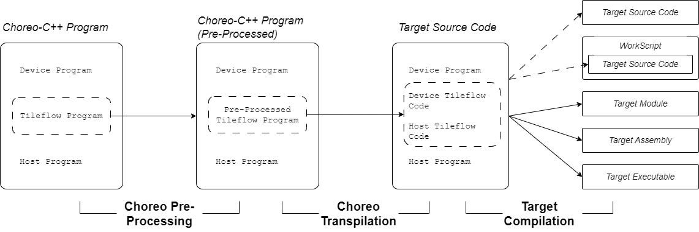
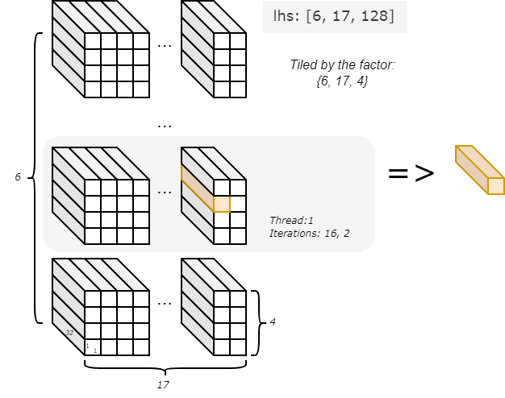

## Overview
In this section, we will introduce the fundamental structure of *Choreo-C++* programs and their associated terminology. Additionally, we will present a parallel element-wise addition *Choreo-C++* program to demonstrate how Choreo simplifies data orchestration across heterogeneous hardware.

## Construct a Choreo-C++ Program
A typical *Choreo-C++* program is composed of multiple parts, depending on the target platform. For a Choreo-supported platform, which is usually a programming environment leveraging heterogeneous parallel hardware, the Choreo-C++ program typically contains three parts:

* The Device Program
* The Host Program
* The Tileflow Program

### Host, Device and Tileflow
The code below showcases a *Choreo-C++* program targeting *CUDA/Cute*:

```choreo
// Device program: typically runs on GPU/NPU
__device__ void device_function(...) {
  // High-performance device kernel implementation
}

// Tileflow program: orchestrating data movement
__co__ void choreo_function(...) {
  // ... choreo code ...
  device_function(...);
  // ...
}

// Host program: typically runs on CPU
void main() {
  // ... prepare data ...
  choreo_function(...);
  // ...
}
```

Let's briefly review each part:

**Host Program**

The *Host Program* serves as the entry point of the *Choreo-C++* module/program and is the caller of the *Tileflow* Program (Choreo Functions). Written in standard C++, it runs on the CPU and manages the overall workflow of the heterogeneous application.

In a simple high-performance kernel implementation, programmers typically prepare the necessary data in the host program to invoke *Choreo functions* and handel their return values to advance further steps.

**Device Program**

The *Device Program* defines computation-intensive operations executed on the target device. In the example above, the device function is prefixed with `__device__`, which is an keyword from *CUDA/Cute*, indicating it runs exclusively on the heterogeneous device. Similar to the *host program*, any device program is not altered in Choreo compilation process.

**Tileflow Program**

Those familiar with *CUDA/Cute* may already be acquainted with host programs and device programs. However, the *Tileflow Program*, composed of *Choreo functions* (prefixed with `__co__`), is the core of *Choreo-C++* programs. It orchestrates data movement among different hosts/devices and among different storage levels within a single device. In a typical workflow, the Tileflow program moves data to an appropriate storage location (as buffer) and calls *device programs* to perform computations. Once the work is complete, it moves the results back to the host.

### Transpilation and Compilation
The Choreo compilation process typically involves three major steps: **Pre-processing**, **Transpilation**, and **Target Compilation**. To better understand how different parts of a Choreo-C++ program work together, the full compilation workflow is illustrated below:



As shown in the figure, immediately after *pre-processing*, Choreo *transpiles* (*source-to-source* compilation) the *tileflow program* into target code, leaving the user-provided *host program* and *device program* unchanged. The *tileflow program* is *transpiled* into host and device source code, which we refer to as *choreo-generated code*. The compiler then combines the user-provided code and *choreo-generated* code to perform the *target compilation* process. This process can generate various outputs, such as transpiled source code, workscripts, target modules, target assembly, and executables.

Thus, the Choreo compiler functions as a end-to-end compiler, with the key step being the transpilation of the *tileflow program* into *choreo-generated code*.

One notable feature of Choreo compilation is its support for both:

- **Single Source Compilation Model**: Similar to *CUDA/Cute*, where the target compiler allows device and host programs to be in a single source file for target compilation.
- **Separate Source Compilation Model**: Similar to *OpenCL*, where host and device code must be compiled separately.

The code shown above naturally supports the *Single Source Compilation Model*. However, to support the *Separate Source Compilation Model*, Choreo requires wrapping the Device Program with the `__cok__` block, as shown below:

```choreo
__cok__ {
  void device_function(...) { ... }
} // end of __cok__

__co__ void choreo_function(...) { ... }

void foo() { ... }
```

This is the code structure for a *Choreo-OpenCL C++* program. The OpenCL compiler requires the device program (`device_function` in the code) to be stored in a separate file from the host program. The `__cok__ {}` wrapper enables the Choreo compiler to handle user-provided device code properly. It helps Choreo separate device and host code from a single Choreo source file for different compilation processes. Therefore, do not be surprised if you encounter `__cok__` in certain Choreo code; it is necessary for integrating support for the *Separate Source Compilation Model*.

## A Full Choreo-Cute C++ Code Example
Below is a complete *Choreo-Cute C++* code example that performs element-wise addition on two arrays of the same size and element type:

```choreo
// Device Program
__device__ void kernel(int * a, int * b, int * c, int n) {
  for (int i = 0; i < n; ++i) c[i] = a[i] + b[i];
}

// Tileflow Program
__co__ s32 [6, 17, 128] ele_add(s32 [6, 17, 128] lhs, s32 [6, 17, 128] rhs) {
  s32 [lhs.span] output; // Use same shape as lhs

  // first `parallel` indicates the kernel launch
  parallel p by 6 {
    with index in [17, 4] { // Tiling factors
      foreach index {
        lhs_load = dma.copy lhs.chunkat(p, index) => local;
        rhs_load = dma.copy rhs.chunkat(p, index) => local;

        local s32 [lhs_load.span] l1_out;

        // Call kernel with loaded data
        call kernel(lhs_load.data, rhs_load.data, l1_out, |lhs_load.span|);

        // Store result back to output
        dma.copy l1_out => output.chunkat(p, index);
      }
    }
  }
  return output;
}

// Host Program
int main() {
  // Define data arrays
  choreo::s32 a[6][17][128] = {0};
  choreo::s32 b[6][17][128] = {0};

  // Fill arrays with data
  std::fill_n(&a[0][0][0], sizeof(a) / sizeof(a[0][0][0]), 1);
  std::fill_n(&b[0][0][0], sizeof(b) / sizeof(b[0][0][0]), 2);

  // Call Choreo function (data movement and device kernel execution)
  auto res = ele_add(choreo::make_spanview<3>(&a[0][0][0], {6, 17, 128}),
                     choreo::make_spanview<3>(&b[0][0][0], {6, 17, 128}));

  // Verification: check correctness of results
  for (size_t i = 0; i < res.shape()[0]; ++i)
    for (size_t j = 0; j < res.shape()[1]; ++j)
      for (size_t k = 0; k < res.shape()[2]; ++k)
        if (a[i][j][k] + b[i][j][k] != res[i][j][k]) {
          std::cerr << "result does not match.\n";
          abort();
        }

  std::cout << "Test Passed\n" << std::endl;
}
```

The subsequent sections will explain the different parts of the code.

### Host Program - the Control Center
As introduced, the **host program** serves as the entry point of the *Choreo-C++* program and acts as the control center. For convenience, here is the code again:

```choreo
int main() {
  // Define data arrays
  choreo::s32 a[6][17][128] = {0};
  choreo::s32 b[6][17][128] = {0};

  // Fill arrays with data
  std::fill_n(&a[0][0][0], sizeof(a) / sizeof(a[0][0][0]), 1);
  std::fill_n(&b[0][0][0], sizeof(b) / sizeof(b[0][0][0]), 2);

  // Call Choreo function (data movement and device kernel execution)
  auto res = ele_add(choreo::make_spanview<3>(&a[0][0][0], {6, 17, 128}),
                     choreo::make_spanview<3>(&b[0][0][0], {6, 17, 128}));

  // Verification: check correctness of results
  for (size_t i = 0; i < res.shape()[0]; ++i)
    for (size_t j = 0; j < res.shape()[1]; ++j)
      for (size_t k = 0; k < res.shape()[2]; ++k)
        if (a[i][j][k] + b[i][j][k] != res[i][j][k]) {
          std::cerr << "result does not match.\n";
          abort();
        }

  std::cout << "Test Passed\n" << std::endl;
}
```

The `main` function is written with standard C++, except for the use of Choreo APIs. In this program, we first define two arrays, `a` and `b`, and fill them with different values. The API `choreo::make_spanview` is then used to attach shape information to the data.

The `choreo::make_spanview` is declared as follows:

```cpp
template <size_t Rank, typename T>
spanned_view<T, Rank> make_spanview(T* ptr, std::initializer_list<size_t> init);
```

Here is the usage for reference:
```cpp
choreo::make_spanview<3>(&a[0][0][0], {6, 17, 128});
```

This API is essential for connecting *host code* to the *choreo functions*. Essentially, any input buffer (named the `spanned` data) of choreo function is always associated with its shape. It enables Choreo to guarantee shape safety at compile and runtime.

**Note:** The most significant dimension value comes first in the `initializer_list` shape. Thus, a shape of `{6, 17, 128}` corresponds to a C multi-dimensional array like `a[6][17][128]`.

In the example code, choreo function `ele_add` is called to calculate the element-wise sum in parallel. Afterward, the host code verifies the result buffer `res`.

One important detail is that the output of the choreo function is of type `choreo::spanned_data`. Unlike `choreo::spanned_view`, which does not own the buffer memory of the data it points to, `choreo::spanned_data` owns the buffer. This ensures that the subsequent data verification process is applied to valid memory. The `choreo::spanned_view` provides rich APIs, supporting C-style array indexing and shape queries via the member function `.shape()`.

Similarly, the most significant dimension is listed first in this shape array (`res.shape()[0]` in this case). Choreo follows a '**most-significant-dimension-major**' ordering, also known as '**row-major**' ordering, where the first dimension varies the slowest.

### Device Program: Parallel Computation

The **device program** defines the computational kernel that will be executed on the target device such as a GPU. The kernel is designed to operate on input data, process it in parallel, and generate the output.

We repeat the code as below:

```choreo
__device__ void kernel(int * a, int * b, int * c, int n) {
  for (int i = 0; i < n; ++i) c[i] = a[i] + b[i];
}
```

For targets that only support the _Separated Source Programming Model_, the code may need to be wrapped within a `__cok__ {}` block. The equivalent *Choreo-OpenCL C++* code is shown below:

```choreo
__cok__ {
  extern "C" void kernel(int * a, int * b, int * c, int n) {
    for (int i = 0; i < n; ++i) c[i] = a[i] + b[i];
  }
} // end of __cok__
```

Here, the `extern "C"` annotation replaces the `__device__` keyword used in *CUDA/Cute* target, as *OpenCL* requires C-linkage for the device functions.

Choreo's device programming model varies depending on the target hardware and its supported features. For example, some private targets allows the use of vectorizing programming interfaces, or *intrinsic function* to fully leverage the computational power of the parallel target hardware.

Programmers must be aware that the device program follows the *Single-Program-Multiple-Data (SPMD)* paradigm. In this paradigm, multiple instances of the same device program are executed in parallel, making it highly efficient for exploiting data-level parallelism on target hardware. However, unlike traditional *CUDA/Cute* programs, the device program does not manage data movement —whether between the host and device or across multiple storage levels within the device. Instead, the *tileflow program* orchestrates these tasks in a much simpler and safer manner.

### Tileflow Program: Orchestrating the Data Movement

The *Tileflow Program* consists of *Choreo functions*. As described earlier, it manages the movement of data between the host and the target device, ensuring that data is copied correctly across different storage locations.

For convenience, let’s revisit the code:

```choreo
__co__ s32 [6, 17, 128] ele_add(s32 [6, 17, 128] lhs, s32 [6, 17, 128] rhs) {
  s32 [lhs.span] output; // Use same shape as lhs

  // first `parallel` indicates the kernel launch
  parallel p by 6 {
    with index in [17, 4] { // Tiling factors
      foreach index {
        lhs_load = dma.copy lhs.chunkat(p, index) => local;
        rhs_load = dma.copy rhs.chunkat(p, index) => local;

        local s32 [lhs_load.span] l1_out;

        // Call kernel with loaded data
        call kernel(lhs_load.data, rhs_load.data, l1_out, |lhs_load.span|);

        // Store result back to output
        dma.copy l1_out => output.chunkat(p, index);
      }
    }
  }
  return output;
}
```

In this code, the `__co__`-prefixed choreo function accepts two inputs `lhs` and `rhs`, both with the shape `[6, 17, 128]` and the element type of `s32` (signed 32-bit integer). And the output is defined to have the same shape and type as the inputs.

The `parallel p by 6 {...}` block indicates that the enclosed code runs in parallel. Specifically, six instances of the code are executed concurrently. This implies a transition in the execution environment from the host to the device. For those familiar with *CUDA*, this concept is analogous to a kernel launch, where multiple threads or processes are initiated to perform computations simultaneously on the device.

Inside the `parallel-by` block, a `with-in` block binds the symbol `index` to two values, `17` and `4`. In Choreo, `index` is referred to as a `bounded-ituple` with two `bounded` values, which can be used in `foreach` statements. (We will explain `bounded` types in later chapters.)

The `foreach index {...}` statement is equivalent to the following C code:

```cpp
for (int x = 0; x < 17; x++)  // assume 'x' represents the 1st element of 'index'
  for (int y = 0; y < 4; y++) { ... }  // and 'y' represents the 2nd element of 'index'
```

Within the `foreach` block, the `dma.copy` statement describes how data movement occurs. For example, consider the statement `lhs_load = dma.copy lhs.chunkat(p, index) => local;`:

- The symbol `lhs_load` is called **future** of the DMA operation, which contains information about the DMA destination.
- `dma.copy` invokes a direct DMA data transfer without transforming the shape of the data. The expression on the left-hand side of `=>` represents the DMA source, while the right-hand side represents the destination.
- In this case, the destination is specified as a `local` buffer, which is automatically allocated by the Choreo compiler.
- The source expression `lhs.chunkat(p, index)` is referred to as the **chunkat expression** in Choreo. Here, `p` and `index` tiling factors for the `lhs`. Given that `lhs` has a shape of `[6, 17, 128]` and the upper bounds of `p` and `index` are `6`, `17`, and `4`, the data chunk size is `1x1x32` (`6/6, 17/17, 128/4`). In each iteration, a single data chunk is used as the source, with the exact chunk determined by the current values of `p` and `index`. For example, in parallel thread `1` and the iteration `{16, 2}`, the chunk's offset is set to `{1, 16, 2}`.

This is illustrated in the below figure:



With the DMA statement, different chunks of data tiled from `lhs` are moved iteratively and in parallel from the host to the device's `local` memory. Similarly, the DMA statement manages `rhs` by moving it in small chunks to `local` memory for processing.

Next, the statement `local s32 [lhs_load.span] l1_out;` defines a per-parallel-thread buffer. Note here it takes its shape from the expression `lhs_load.span`, which represents the tiled block. The buffer is used to store the output data in the subsequent `call` statement. The `call` statement invoke the *device function* named `kernel` to perform computations. Once the computation is complete, another DMA statement moves the output data from the `local` buffer back to host. This complete one iteration.

In this code, each parallel thread runs `17x4` iterations, with each iteration handling a `1x1x32`-sized chunk of data. The *choreo program* terminates when all `6` parallel threads have completed their iterations. It then returns the output buffer to its caller, the host program.

## Quick Summary
You are now aware that a Choreo-C++ program consists of three parts, with the *tileflow program* being the core. This part is transpiled into target source code during the compilation process. The call chain typically flows from the host to the tileflow program, and then from the tileflow program to the device code.

You may have noticed that Choreo not only abstracts DMA operations into higher-level semantics but also combines iteration and tiling for ease of use. This makes Choreo code concise and expressive. In the following chapters, we will delve deeper into Choreo's syntax and semantics to explore its full potential.
