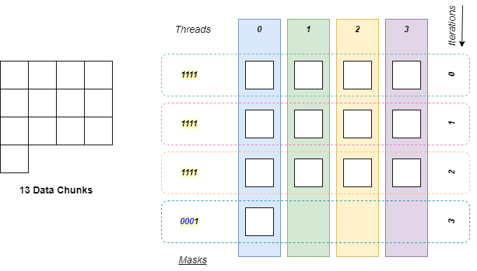

## Overview
While Choreo primarily targets SPMD (Single-Program-Multiple-Data) programming, it also supports MPMD (Multiple-Program-Multiple-Data) execution through thread masking. In this section, we demonstrate how to write divergent code using `inthreads` block in Choreo.

## Mask the Parallel Threads

### Masking in SPMD
It is typically necessary to mask off some *parallel threads* in SPMD programming. For example, programmers often divide data into chunks for parallel or iterative processing. However, there may be a remainder that cannot be evenly distributed across all threads. In such cases, masking some threads is a proper way to leverage parallel hardware while maintaining correct functionality.



The figure aboves showcases a tiling of 13 data chunks, where 4 parallel threads are invoked for the processing of each chunk. In this case, 4 iterations are required to process all the data chunks. However, for the last iteration, only *thread-0* is required to work. You may observe the **thread mask** for each iteration are `1111`, except for the last iteration (`1000`). The thread mask is a combination of boolean bits, where `1` stands for **active**, and `0` stands for **inactive**. So in this case, only *thread-0* is set to be *active* to avoid unnecessary data chunk processing in the last iteration.

### Uniform and Divergence
Masking is an implementation-level concept. From the perspective of the SPMD programming, we typically claim the code that processes data chunks **diverges** because not all the thread instances execute the same code due to masking. And programmers should be aware of that their SPMD code is a combination of:

- **Uniform Code**: *All threads* execute the same code path.
- **Divergent Code**: Only the *masked threads* execute the *divergent* code path.

It is necessary to have the *divergent* code in SPMD code to handle different real-world requirements. And from a perspective of different programming paradigm, applying *divergent* code in SPMD programs can even mimic MPMD (Multiple Program Multiple Data) behavior. In MPMD, different threads execute different code. Therefore, *divergence* can extend SPMD to MPMD scope conceptually.

In Choreo, we are able to create divergent code via `inthreads` block. Let us dive into the detail.

## `inthreads`: Divergent Code with the Thread Mask
### Parallel Perspective of Tileflow Programs
In Choreo, a *divergent* code region is generated with the keyword `inthreads`, where a compare expression followed.

Let us have a look at the following example:

```choreo
__co__  void foo() {
  // sequential code

  // start of the SPMD code region
  parallel p by 6 {
    // some uniform code for all threads
    // ...
    inthreads (p <= 2) {
      // divergent code for thread 0, 1, 2 (thread-mask: 000111)
    }
    // threads are forced to be synchronized
    // some uniform code for all threads
    // ...
  }
  // end of the SPMD code region

  // sequential code
}
```

You may now re-examine Choreo tileflow programs from the perspective of parallelism. It consists of

- *Sequential Code*
- *SPMD-Styled Parallel Code* enclosed in `parallel-by` block, which consists of:
    - *Uniform Code*
    - *Divergent Code* enclosed in `inthreads` block.

In this example, `p <= 2` initiates the the *divergent code block*, where from the implementation perspective, it creates a thread mask of `000111`, which allows only thread `0`, `1` and `2` to execute the code inside. And thread `3`, `4` and `5` will skip this path. **All threads are forced synchronized after the `inthreads` block**. In this case, it implies thread `3`, `4`, and `5` waits for the completion of the others before stepping forward.

In Choreo, the `inthreads` block looks like a `if` conditional block in C/C++. However, `inthreads` explicit claims the code divergence, which is a concept in SPMD program, rather than the conditional block for sequential code. Therefore, the `inthreads` block:

- Can only appear in the SPMD code region, which is enclosed in the `parallel-by` block.
- Can only have a comparison result related to thread identifiers.

Choreo compiler has the checks for both the comparison expression and `inthreads`-block placement.

### Make it Asynchronous
Similar to the `parallel-by` statements, it is possible to make the threads with/without executing the divergent code be asynchronous. The following code showcases a example that conduct MPMD execution in the SPMD code:

```choreo
__co__  void foo() {
  parallel p by 6 {
    inthreads.async (p <= 2) {
      // divergent code for thread 0, 1, 2 (thread-mask: 000111)
    }
    inthreads.async (p > 2) {
      // divergent code for thread 3, 4, 5 (thread-mask: 111000)
    }
    sync.shared; // sync point
                 // all 'inthreads' paths must get executed
  }
}
```
In this example, it divides the parallel threads evenly into two sub-groups, without forcing synchronization after each `inthreads` block. In this way, threads in different groups are executed in parallel, mimicking a MPMD executing. However, the `sync.shared` statement established a **synchronization point** for all threads. That makes sure code for both paths get executed after this *synchronization point*.

Note that, only the outer `inthreads` can be declared as asynchronous. Programmers will get an compile-time error when using `inthreads.async` for any inner `inthreads` block.

## Masking for Multi-Levels
Thread masking can be applied at different parallel levels. The following example demonstrates this:

```choreo
__co__  void foo() {
  parallel p by 3, q by 4 {
    inthreads (p < 2 && q == 0) {
      // divergent code for thread (0, 0), (1, 0)
      // thread-mask: 011-0001
    }
    inthreads (q == 1) {
      // divergent code for thread (0, 1), (1, 1), (2, 1)
      // thread-mask: 111-0010
    }
  }
}
```
This code uses two levels of parallelization:

- Outer level (`p`): Parallel count of 3
- Inner level (`q`): Parallel count of 4

The first `inthreads` predicate (`p < 2 && q == 0`) restricts execution to:

- Outer parallel IDs: `0, 1` (excluding 2)
- Inner parallel ID: `0` only

The thread mask (`011-0001`) reflects these constraints, where the two levels are separated by a hyphen (-).

The second predicate (`q == 1`) imposes no restriction on the outer level (`p`), allowing all outer IDs (`0, 1, 2`) while restricting the inner level to `q == 1`.

## Implicit Masking
In Choreo, code between multiple `parallel-by` levels can be considered as a type of implicit masking. The below code showcases an example:

```
__co__  void foo() {
  parallel p by 6 {
    // implicit masking: 'inthreads (q == 0) { ... } '
    parallel q by 2 {
      // code here is for all threads
    }
    // implicit masking: 'inthreads (q == 0) { ... } '
  }
}
```

In this example, there exists two levels of parallelization. The code inside `parallel p by 6` block but outside `parallel q by 2` blocks is conceptually for the outer parallelization only. This means, only one thread from the sub-level parallelization execute the code, which is equivalent to `inthreads (q == 0) { ... }`. Programmers must be aware there is only single thread instance to execute the code part. Only the code inside the inner `parallel-by` is executed by all threads.

## Quick Summary
In this section, we examined the motivation for thread masking, which enables divergent code execution for MPMD-style programming within Choreo's SPMD paradigm. Developers can use either explicit thread masking via `inthreads` blocks or implicit control through `parallel-by` constructs to restrict execution to specific threads.

While thread masking provides flexibility, it introduces thread asynchrony that complicates coordination. The next section will explore advanced techniques for managing these synchronization challenges.
