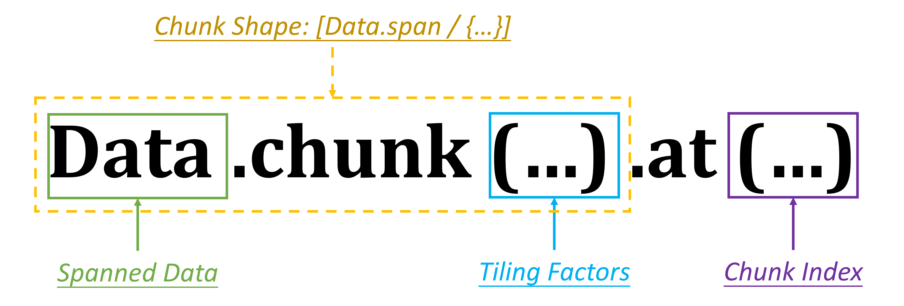

## Overview
In this section, we will introduce the *chunkat expression* for the DMA statement, which is the core concept of Choreo that simplifies data movement coding.

## *Ubound* Operation
In the previous chapter, we learned that a *bounded variable* defined by a `parallel-by` or `with-in` statement is either an *integer* or an *ituple* with one or more bounds. We also learned how to use the *current value* and *upper-bound value* of the *bounded variable* to construct loops in `foreach` blocks, where the *upper-bound* is implicitly used.

However, in Choreo, you can use the **ubound operation** to explicitly retrieve the upper bound of a bounded variable. *Ubound* is a unary operation that uses the prefix symbol `#` before a bounded variable. For example:

```choreo
with size in [32] {
  local u8 [#size, 16] a; // buffer shape: [32, 16]
  local u8 [size, 16] b; // error in shape: [0, 16]
}
```

In this code, the local buffer `a` is shaped as `[32, 16]`, since `#size` evaluates to the upper-bound of `size`. However, the declaration of `b` uses the *current value* of `size`, resulting in an incorrect shape definition.

## Use `chunkat` Expression to Tile Data
In all the examples from the previous section, the *data expressions* of the *DMA statement* directly utilized the *spanned* data or *storage* annotation. However, programmers can use the **chunkat** expression to enable tiling behavior in practice. For example:

```choreo
__co__ void foo(f32 [36] input) {
  parallel p by 6 {
    dma.copy input.chunkat(p) => shared;
  }
}
```

In this example, the built-in member function `.chunkat` is used to create a tile or block for the source expression of the DMA statement. Each tiled block is called a **chunk** in Choreo. The `.chunkat(...)` data expression can be considered a simpler form of `.chunk(...).at(...)`, where the semantics of each part are illustrated in the figure below:



Considering the expression `input.chunkat(p)`, which is equivalent to `input.chunk(#p).at(p)`:

- `input` is the *spanned data* to be tiled.
- `#p` indicates the **tiling factor**. It also specifies the total **chunk count** for each dimension to process. In this case, the 1D input is tiled by `6`, resulting in `6` chunks to be processed.
- `.chunk(#p)` determines the **chunk shape**. The chunk is a 1D data segment tiled from `input`, with its size being the data *mdspan* divided by the *upper-bound* of the bounded variable. In this example, the chunk shape is calculated as `[input.span / #p] = [6]`.
- `.at(p)` determines the **chunk index**. Here, `p` ranges from `[0, 6)`, allowing parallel threads to process different chunks of `input`. Specifically, parallel thread `1` processes a chunk with elements `[6, 12)` from `input`, while parallel thread `5` processes a chunk with elements `[30, 36)`, and so on.

In many scenarios, it is unnecessary to use separate `.chunk` and `.at` expressions, as `.chunkat` takes bounded variables as parameters. The upper-bounds of these variables act as the *tiling factors*, and their current values act as the *chunk index*.

## Use Multiple Bounded Variables
The following code showcases an example that utilizes multiple bounded variables:

```choreo
__co__ void foo(f32 [36, 14, 8] input) {
  parallel p by 6 {
    with index in [7, 4] {
      foreach index {
        dma.copy input.chunkat(p, index) => shared;
      }
    }
  }
}
```

In this example, there are two bounded variables: `p` is the *bounded integer* defined by the `parallel-by` statement, while `index` is the *bounded ituple* with two integers. The `chunkat` expression concatenates them to form a *bounded ituple* with upper-bounds `{#p, #index}` and current values `{p, index}`. Thus, the shape of each chunk is calculated as `[36, 14, 8] / {#p, #index} = [36, 14, 8] / {6, 7, 4} = [6, 2, 2]`.

In addition, since `p` is the bounded variable for parallelization, there are `6` threads working in parallel, each handling a large chunk of `[6, 14, 8]`. Within a single parallel thread, it iterates `7x4` times, each time moving a `[6, 2, 2]` small chunk to a compiler-allocated `shared` memory.

With this approach, we can apply tiling to data movement, where each iteration in each parallel thread selects only a part of the data/buffer for transfer. The Choreo compiler uses information about the *spanned* data and the *bounded variables* to transpile the DMA statement into C++ subscripting, DMA configurations, etc., simplifying the trivial and error-prone work that C++ programmers typically face. This makes learning the Choreo syntax worthwhile.

## Tile and Flow
It is possible to use the `chunkat` expression for either the source or the destination of a *DMA statement*. When `chunkat` is used only for the source, it typically divides the input or buffer into smaller chunks to move it to storage closer to the processor. In contrast, when `chunkat` is used only for the destination, it typically moves the buffer to compose part of the output. The following code showcases an example:

```choreo
__co__ auto foo(f32 [36] input) {
  f32 [36] output;
  parallel p by 6 {
    f0 = dma.copy input.chunkat(p) => shared;  // tile the source
    dma.copy f0.data => output.chunkat(p);     // un-tile the destination
  }
  return output;
}
```

In this example, the statement applies `chunkat` to the destination, moving the data block in `shared` and "un-tiling" each block to the output. Note that the Choreo compiler **requires the source data and destination data to have the same shape and element type** if not using *storage* as the destination *data expression*.

However, using the `chunkat` expression for both the source and destination is rarely supported by any target platform at this time.

## Quick Summary
In this section, we learned about using the `chunkat` expression in Choreo for tiling data in DMA statements, which allows dividing data into smaller chunks for efficient processing. We explored how `chunkat` can be applied to either the source or destination of a DMA statement to manage data movement between memory and processors.

Now, you may try to write a full tileflow program. Wish you good luck!
