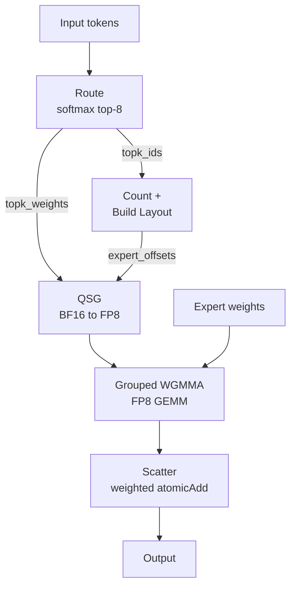
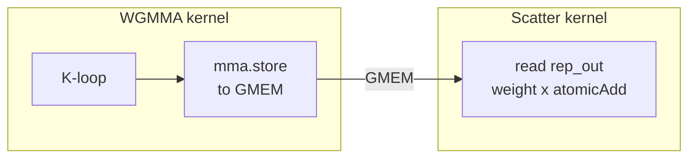

# Fused MoE FP8: 8.09 → 13.18 TFLOPS (1.63×)

In this tutorial, we walk through the process of optimizing a **fused Mixture-of-Experts (MoE) end-to-end kernel** written in [Croqtile](https://codes1gn.github.io/croktile-tutorial/). The target workload is real-world inference from **Qwen3.5-35B-A3B**, a model that routes each token through 8 of 256 experts. Our goal: make the full pipeline — routing, quantization, grouped GEMM, and scatter — as fast as possible on an NVIDIA H800 PCIe (SM90), using only Croqtile `.co` source code.

### The Pipeline at a Glance

Unlike a standard matrix multiplication, a fused MoE kernel is an *ensemble* of data-dependent stages. Here's the full forward pass for one inference step:



The grouped GEMM uses FP8 Tensor Cores via WGMMA, but the surrounding "glue" — routing, quantization, sorting, scatter — dominates at small batch sizes. With 256 experts and only 128 tokens, most experts see just ~4 tokens. That's where the real optimization happens.

### Optimization Roadmap

| Stage | Milestone `.co` | TFLOPS | Key Idea |
|-------|----------------|-------:|--------|
| Baseline (7 kernels) | [`00_baseline.co`](../assets/fused-moe-fp8/00_baseline.co) | 8.09 | Naive pipeline: route → count → build → quant → sort → WGMMA → scatter |
| **Phase 1: Kernel Fusion** | [`03_all_fusions.co`](../assets/fused-moe-fp8/03_all_fusions.co) | 9.45 | Fuse scatter into WGMMA, quant+sort, count+build |
| **Phase 2–3: Host + Micro** | [`04_host_micro.co`](../assets/fused-moe-fp8/04_host_micro.co) | 9.89 | `parallel.async`, CUDA Graphs, vectorize scatter, batch quantization, `yield`, `mma.store` scatter |
| **Phase 4–5: Memory + Peripheral** | [`05_cuda_optimized.co`](../assets/fused-moe-fp8/05_cuda_optimized.co) | **13.18** | Grid swap, L2 persist, QSG pipelining, prefix scan, `__cpp__` scatter |

---

## The Problem: Fused MoE for Qwen3.5

**Mixture-of-Experts (MoE)** is a sparsity technique where each token is routed to a small subset of "expert" sub-networks. Qwen3.5-35B-A3B uses a particularly aggressive configuration:

| Parameter | Value | Notes |
|-----------|-------|-------|
| Tokens (M) | 128 | Typical inference batch |
| Output dim (N) | 512 | Expert FFN hidden size |
| Input dim (K) | 2048 | Expert FFN input size |
| Experts | 256 | Unusually large expert pool |
| Top-K | 8 | Active experts per token |
| Precision | FP8 (E4M3) | Blockwise quantized inputs + weights |
| Block shape | 128×128 | FP8 quantization granularity |

The total FLOPs per forward pass: `2 × 128 × 8 × 512 × 2048 ≅ 2.15 GFLOP`. At the theoretical peak of ~30 TFLOPS for FP8 WGMMA on H800, this should take about 72µs. Our baseline takes ~265µs. That's a **3.7× gap** from roofline — and unlike dense GEMM, you can't close it by just tiling better.

The challenge is that with 256 experts and only 128 tokens, most experts see just 4 tokens on average. The grouped GEMM tiles are tiny (4×512×2048), and the "glue" around the GEMM — routing, quantization, sorting, scatter — becomes a significant fraction of total runtime. This is fundamentally different from optimizing a large matmul.

### About Croqtile

All kernel code in this post is written in **Croqtile's `.co` format** — a C++ Embedded Domain-Specific Language (EDSL) that compiles to CUDA/CuTe C++. You write high-level GPU kernels using Croqtile primitives, and the compiler generates optimized CUDA code. When the EDSL doesn't yet express a pattern, `__cpp__("...")` blocks let you embed raw CUDA inline — you stay in the same `.co` file, no post-processing needed. The workflow is:

```
.co source  →  Croqtile compiler  →  .cute.result (CUDA C++)  →  nvcc  →  binary
```

Every optimization in this post is **reproducible from `.co` source** by compiling with the Croqtile compiler. No manual editing of generated CUDA is required. The vast majority of optimizations use native Croqtile primitives; a few use `__cpp__` escape-hatch blocks for patterns not yet in the language (like `cudaAccessPolicyWindow` for L2 cache control or 128-bit SIMD stores). These are part of the Croqtile language, not external post-processing.

---

## Baseline: 7 Kernels, 8.09 TFLOPS

> **Source:** [`00_baseline.co`](../assets/fused-moe-fp8/00_baseline.co) — fully reproducible from `.co`

The baseline implements the fused MoE pipeline as **7 separate kernel launches**:

```
route → count → build_layout → quantize → sort_gather → WGMMA → scatter
```

Each kernel launch incurs overhead: TMA descriptor creation, parameter packing, and a CPU-GPU synchronization. Plus, intermediate buffers must be materialized in global memory between kernels. Here's what each kernel does:

**1. Route** (`fused_moe_route`) — Softmax over 256 experts with softcapping (tanh), then top-8 selection via warp-level shuffle reductions. One warp (32 threads) processes all 256 experts per token, with 8 values per thread.

**2. Count Experts** (`fused_moe_count_experts`) — Each of M×topk threads atomically increments the count for its assigned expert. Simple but requires a separate kernel launch.

**3. Build Layout** (`fused_moe_build_layout`) — Exclusive prefix sum over expert counts to compute expert offsets. This runs on *a single thread* doing a serial O(256) scan. Yes, one thread.

**4. Quantize Input** (`fused_moe_quantize_input`) — Per-block-of-128 FP8 quantization: find max absolute value via warp shuffles across 4 warps, compute scale = max/448, then quantize each element.

**5. Sort & Gather** (`fused_moe_sort_and_gather_quant_input`) — For each token, assign expert slots via `atomicAdd`, then copy quantized data to the sorted position.

**6. Grouped WGMMA** (`fused_moe_grouped_wgmma_fp8`) — The actual FP8 GEMM using Hopper's Warp Group Matrix Multiply Accumulate instruction. Grid of 1024 CTAs (256 experts × 4 N-blocks), 128 threads each.

**7. Scatter to Output** (`fused_moe_scatter_rows_to_output`) — Reads the BF16 WGMMA output from global memory, multiplies by routing weight, and does a weighted `atomicAdd` scatter back to the original token positions.

The baseline host code launches all 7 kernels sequentially from `main()`. In Croqtile, `__co__` functions are called like regular C++ functions — the compiler generates CUDA launch wrappers:

```cpp
// Baseline main() — 7 kernel launches + 3 memsets
choreo::abend_true(cudaMemset(expert_counts_d, 0, ...));
choreo::abend_true(cudaMemset(output_d, 0, ...));

fused_moe_route(gating_d, topk_ids_d, topk_weights_d, expert_counts_d);
fused_moe_count_experts(topk_ids_d, expert_counts_d);
fused_moe_build_layout(expert_counts_d, expert_offsets_d, expert_write_offsets_d);
fused_moe_quantize_input(input_d, input_q_d, input_scales_d);
fused_moe_sort_and_gather_quant_input(
    input_q_d, input_scales_d, topk_ids_d,
    expert_write_offsets_d, sorted_route_ids_d, rep_a_q_d, rep_a_scales_d);
fused_moe_grouped_wgmma_fp8(
    rep_a_q_d, rep_a_scales_d, expert_weights_d,
    expert_scales_d, expert_offsets_d, rep_out_d);
fused_moe_scatter_rows_to_output(
    rep_out_d, sorted_route_ids_d, topk_weights_d, output_d);
```

Here's the baseline `build_layout` kernel — the single-threaded serial prefix sum:

```co
__co__ void fused_moe_build_layout(
    global s32 [NUM_EXPERTS] expert_counts,
    global s32 [NUM_EXPERTS + 1] expert_offsets,
    global s32 [NUM_EXPERTS] expert_write_offsets) {
  parallel tid by NUM_EXPERTS : thread {
    inthreads (tid == 0) {
      s32 prefix = 0;
      expert_offsets.at(0) = 0;
      foreach expert in [NUM_EXPERTS] {
        s32 count = expert_counts.at(expert);
        expert_offsets.at(expert + 1) = prefix + count;
        expert_write_offsets.at(expert) = prefix;
        prefix = prefix + count;
      }
    }
  }
}
```

And the WGMMA kernel — the core grouped GEMM that dominates runtime:

```co
// Baseline: grouped WGMMA with separate mma.store to global memory
__co__ void fused_moe_grouped_wgmma_fp8(
    global f8_e4m3 [M, K] lhs, global f32 [M, K_BLOCKS] scale_a,
    global f8_e4m3 [EXPERT_N, K] rhs,
    global f32 [NUM_EXPERTS * N_BLOCKS, K_BLOCKS] scale_b,
    global s32 [NUM_EXPERTS + 1] expert_offsets,
    global bf16 [M, N] output) {

  parallel.async {eid, block_n}
      by [NUM_EXPERTS, cdiv(N, WARP_N)] : block
  parallel by 1 : group-4
  parallel t by 128 : thread {
    shared f8_e4m3 [WARP_M, TILE_K] sA;
    shared f8_e4m3 [WARP_N, TILE_K] sB;

    s32 seg_start = expert_offsets.at(eid);
    s32 seg_end   = expert_offsets.at(eid + 1);
    if (seg_end - seg_start <= 0) yield;

    foreach iv_m in [cdiv(seg_length, WARP_M)] {
      mc = mma.fill.f32 0.0f;
      foreach iv_k in [K_BLOCKS] {
        // LHS via cp.async DMA, RHS via TMA
        dma.copy.swiz<128>.zfill
            lhs.view(WARP_M, TILE_K).from(
                seg_start + iv_m * WARP_M, iv_k * TILE_K)
            => sA.subspan(tile_rows, TILE_K);
        tma.copy.swiz<128>
            rhs.subspan(WARP_N, TILE_K).at(eid # block_n, iv_k) => sB;

        foreach iv_warp in [TILE_K / WARP_K] {
          ma = mma.load.swiz<128> sA.chunkat(_, iv_warp);
          mb = mma.load.swiz<128> sB.chunkat(_, iv_warp);
          mma.row.row mc, ma, mb;
        }
        // FP8 blockwise scale: dual accumulator pattern
        mma.scale mc, scale_a.view(...).from(...), scale_b.at(...);
      }
      // Store to intermediate buffer — scatter is a SEPARATE kernel
      mma.store mc, output.view(tile_rows, WARP_N).from(...);
    }
  }
}
```
### Lower Bounding the Fastest Possible Runtime

- **Compute:** 2.15 GFLOP at ~30 TFLOPS FP8 = 72µs
- **Memory:** LHS data: 1024 rows × 2KB = 2MB. RHS data: per CTA 128×128 bytes × 16 K-blocks = 256KB (but shared across CTAs via L2). Minimum traffic ~4MB at 2TB/s = 2µs.
- **The real bottleneck** is neither pure compute nor pure memory: it's the tiny tile sizes per expert and the overhead of the surrounding kernels.

---

## Phase 1: Kernel Fusion (8.09 → 9.45 TFLOPS)

> **Source:** [`01_scatter_fusion.co`](../assets/fused-moe-fp8/01_scatter_fusion.co), [`02_qsg_fusion.co`](../assets/fused-moe-fp8/02_qsg_fusion.co), [`03_all_fusions.co`](../assets/fused-moe-fp8/03_all_fusions.co) — fully reproducible from `.co`

The first major optimization phase focuses on reducing the 7 kernels down to fewer, fused kernels. Each fusion eliminates kernel launch overhead, `cudaDeviceSynchronize()` calls, and intermediate global memory traffic.

### Fusion 1: Scatter into WGMMA · iter007 · 8.22 TFLOPS (+1.6%)

The baseline runs WGMMA and scatter as **two separate kernels**, with a global memory round-trip between them:



The WGMMA kernel stores its result to `rep_out` in global memory. Then a separate scatter kernel reads it back, multiplies by the routing weight, and does `atomicAdd` to the final output. This costs one full kernel launch + a global memory write/read round-trip.

**Before — the baseline WGMMA epilogue** stores to an intermediate global buffer:

```co
// Baseline WGMMA: store result to global memory
// A separate scatter kernel will read this later
      mma.store mc, output.view(tile_rows, WARP_N).from(...);
    }  // end foreach iv_m
  }
}

// Separate scatter kernel — reads WGMMA output back from global memory
__co__ void fused_moe_scatter_rows_to_output(
    global bf16 [MAX_SORTED_ROUTES, N] rep_out,
    global s32 [MAX_SORTED_ROUTES] sorted_route_ids,
    global f32 [M, TOPK] topk_weights,
    global f32 [M, N] output) {
  parallel sorted_row by M * TOPK : block {
    route_id = sorted_route_ids.at(sorted_row);
    token = route_id / TOPK;
    weight = topk_weights.at(token, route_id % TOPK);
    parallel lane by WARP_N : thread {
      foreach block_n in [cdiv(N, WARP_N)] {
        out_col = block_n * WARP_N + lane;
        val = rep_out.at(sorted_row, out_col) * weight;
        call ATOMIC_ADD(&output.at(token, out_col), val);
      }
    }
  }
}
```

**After — fused epilogue** replaces `mma.store → GMEM` with `mma.store → shared`, then scatters directly inside the same kernel:

```co
// Fused WGMMA+scatter: store to shared, scatter to output in one kernel
// Replaces both the GMEM store AND the separate scatter kernel
      shared f32 [WARP_M, WARP_N] sOut;
      mma.store mc, sOut;
      sync.shared;

      foreach local_row in [WARP_M] {
        if (local_row < tile_rows) {
          s32 actual_row = seg_start + iv_m * WARP_M + local_row;
          s32 route_id = sorted_route_ids.at(actual_row);
          s32 token = route_id / TOPK;
          s32 selected = route_id % TOPK;
          f32 weight = topk_weights.at(token, selected);
          f32 val = sOut.at(local_row, t) * weight;
          call ATOMIC_ADD(&scatter_output.at(token, block_n * WARP_N + t), val);
        }
      }
    }  // end foreach iv_m
  }
}
```

The fused version is pure native Croqtile — no `__cpp__` needed. `mma.store` handles the hardware-specific accumulator fragment layout, and the `foreach` + `call ATOMIC_ADD` loop is straightforward. The data flows from MMA registers → shared memory → global output without ever touching the intermediate `rep_out` buffer in DRAM.

A later iteration (iter014) further optimized this by accessing MMA registers directly via `__cpp__`, eliminating the shared memory staging — but the native version shown here is the simpler starting point.

  Scatter fusion alone gives a modest +1.6% because the scatter isn't on the critical path at this stage. But it eliminates the `rep_out` intermediate buffer and one full kernel launch. The real payoff comes when combined with other fusions.

### Fusion 2: Quantize + Sort → Single QSG Kernel · iter009 · 8.92 TFLOPS (+8.5%)

The quantize and sort-gather kernels both iterate over all M tokens. Fusing them into a single kernel (QSG — Quantize, Sort, Gather) eliminates one kernel launch and the intermediate `input_q` global memory buffer. Each block processes one token through three phases: quantize to FP8 via shared memory, assign sorted slots via atomicAdd, then copy quantized data to sorted positions.

```co
__co__ void fused_moe_quant_sort_gather(
    global bf16 [M, K] input,
    global s32 [M, TOPK] topk_ids,
    global s32 [NUM_EXPERTS] expert_write_offsets,
    global s32 [MAX_SORTED_ROUTES] sorted_route_ids,
    global f8_e4m3 [MAX_SORTED_ROUTES, K] rep_a_q,
    global f32 [K_BLOCKS, MAX_SORTED_ROUTES] rep_a_scales) {
  parallel token by M : block {
    shared f32 [4] warp_max;
    shared f8_e4m3 [K] sq;          // quantized row in smem
    shared f32 [K_BLOCKS] ss;       // per-block scales
    shared s32 [TOPK] route_slots;
    parallel lane by 128 : thread {
      // Phase 1: Quantize BF16 → FP8 via shared memory
      foreach block_k in [K_BLOCKS] {
        kk = block_k * BLOCK_K + lane;
        f32 value = input.at(token, kk);
        // warp-shuffle reduction for block max ...
        f32 inv_scale = 1.0f / ss.at(block_k);
        sq.at(kk) = value * inv_scale;  // FP8 quantize
      }
      sync.shared;
      // Phase 2: Assign sorted slots via atomicAdd
      inthreads (lane == 0) {
        foreach selected in [TOPK] {
          expert = topk_ids.at(token, selected);
          s32 slot = call ATOMIC_ADD(
              &expert_write_offsets.at(expert), 1);
          route_slots.at(selected) = slot;
          sorted_route_ids.at(slot) = token # selected;
        }
      }
      sync.shared;
      // Phase 3: Copy quantized data to sorted positions
      foreach selected in [TOPK] {
        s32 slot = route_slots.at(selected);
        foreach block_k in [K_BLOCKS] {
          kk = block_k * BLOCK_K + lane;
          if (lane < K_BLOCKS && block_k == 0)
            rep_a_scales.at(lane, slot) = ss.at(lane);
          if (kk < K) rep_a_q.at(slot, kk) = sq.at(kk);
        }
      }
    }
  }
}
```

### Fusion 3: Count + Build Layout · iter017–018 · 9.45 TFLOPS (+5.9%)

The count_experts and build_layout kernels are tiny — just counting and prefix-summing expert assignments. Fusing them into `fused_moe_count_and_build` using shared-memory atomics eliminates one kernel launch plus the `cudaDeviceSynchronize` + `cudaMemset` that separated them:

```co
__co__ void fused_moe_count_and_build(
    global s32 [M, TOPK] topk_ids,
    global s32 [NUM_EXPERTS + 1] expert_offsets,
    global s32 [NUM_EXPERTS] expert_write_offsets) {
  parallel tid by NUM_EXPERTS : thread {
    shared s32 [NUM_EXPERTS] s_counts;
    shared s32 [NUM_EXPERTS + 1] s_offsets;

    s_counts.at(tid) = 0;
    sync.shared;

    // Count: each thread strides over all M*TOPK assignments
    foreach i in [cdiv(M * TOPK, NUM_EXPERTS)] {
      s32 idx = tid + i * NUM_EXPERTS;
      if (idx < M * TOPK) {
        s32 expert = topk_ids.at(idx / TOPK, idx % TOPK);
        call ATOMIC_ADD(&s_counts.at(expert), 1);
      }
    }
    sync.shared;

    // Prefix sum (single thread, 256 experts)
    inthreads (tid == 0) {
      s32 prefix = 0;
      s_offsets.at(0) = 0;
      foreach expert in [NUM_EXPERTS] {
        s32 count = s_counts.at(expert);
        s_offsets.at(expert + 1) = prefix + count;
        prefix = prefix + count;
      }
    }
    sync.shared;

    expert_write_offsets.at(tid) = s_offsets.at(tid);
    expert_offsets.at(tid) = s_offsets.at(tid);
  }
}
```

This is fully native Croqtile — each of the 256 threads strides over the flat `M*TOPK` array using `foreach`, atomically counting expert assignments into shared memory, then thread 0 does the serial prefix sum.

### Compiler Flags: The Easy Wins · iter015–019

These flags are applied at compile time. Their effect is small at the Phase 1 milestone ([03_all_fusions.co](../assets/fused-moe-fp8/03_all_fusions.co) with flags: 9.47 vs without: 9.45 = +0.2%), but becomes significant in later phases when the WGMMA kernel dominates runtime:

| Flag | Effect | Δ (original A/B) |
|------|--------|---|
| `--use_fast_math` | Faster expf/divf in routing softmax, FTZ mode | +0.5% |
| `--disable-runtime-check` | Remove choreo_assert() function boundaries serializing WGMMA pipeline | +2.4% |
| `--hoist-offset --hoist-scale` | Hoist loop-invariant address/scale calculations out of K-loop | +0.9% |
| Transpose `rep_a_scales` layout | Coalesced WGMMA reads: [routes, K_blocks] → [K_blocks, routes] | +1.3% |

!!! info "The `--disable-runtime-check` story"
    The Croqtile compiler inserts `choreo_assert()` for bounds checking. On GPU, these create function call boundaries that prevent `ptxas` from scheduling WGMMA instructions across loop iterations (emitting warning C7510: "register-register dependency for WGMMA"). Removing them gave a surprisingly large 2.4% speedup. Lesson: compiler infrastructure can silently break GPU instruction pipelining.

After this phase, the serving-path pipeline is down to **4 kernels** (3 in the graph-captured path):

```
route → count+build → QSG → WGMMA+scatter
```

---

## Phase 2: Host Pipeline & CUDA Graphs (9.45 → 9.89 TFLOPS)

> **Source:** [`04_host_micro.co`](../assets/fused-moe-fp8/04_host_micro.co) — measured at **9.89 TFLOPS**. This milestone also includes Phase 3 micro-optimizations (local arrays, yield, mma.store scatter).

### Remove Host-Device Synchronization · iter021–023 · +4.7%

This was the single largest improvement after kernel fusion, and it came from a surprisingly mundane source.

In the `.co` source, the fix is a single keyword: change `parallel` to `parallel.async` in the kernel's top-level decomposition:

```co
// Before: plain parallel — compiler emits cudaDeviceSynchronize after launch
__co__ void fused_moe_quant_sort_gather(...) {
  parallel token by M : block {
    // ...
  }
}

// After: parallel.async — compiler omits the sync
__co__ void fused_moe_quant_sort_gather(...) {
  parallel.async token by M : block {
    // ...
  }
}
```

This one-keyword change affects the **generated CUDA wrapper** — the compiler no longer emits `cudaDeviceSynchronize()` after the kernel launch:

```cpp
// Generated WITHOUT parallel.async:
void launch_fused_moe_qsg(...) {
  fused_moe_qsg_kernel<<<grid, block>>>(...);
  cudaDeviceSynchronize();  // BLOCKS CPU for ~30us!
}

// Generated WITH parallel.async:
void launch_fused_moe_qsg(...) {
  fused_moe_qsg_kernel<<<grid, block>>>(...);
  // CPU immediately returns to submit next kernel
}
```

!!! success "Result"
    +4.7% from removing host-device synchronization between kernel launches. The CPU was blocking for ~30µs per kernel — three times per iteration. The lesson: *never block the CPU between kernel launches on the same stream unless you need the result.* In Croqtile, `parallel.async` makes this a zero-effort change.

### CUDA Graphs · iter024–025 · +2.2%

With 3 kernels in the serving path (count_and_build, QSG, WGMMA), kernel launch overhead is still meaningful at these sub-200µs timescales. CUDA Graphs capture the entire 3-kernel sequence and replay it with a single `cudaGraphLaunch`, eliminating per-kernel CPU-side parameter packing and TMA descriptor recreation:

```cpp
// In main() — define the serving-path as a lambda
auto launch_serving_path = [&]() {
  choreo::abend_true(cudaMemsetAsync(
      output_d, 0, M * N * sizeof(float), 0));

  fused_moe_count_and_build(
      topk_ids_d_view, expert_offsets_d_view,
      expert_write_offsets_d_view);
  fused_moe_quant_sort_gather(
      input_d_view, topk_ids_d_view,
      expert_write_offsets_d_view,
      sorted_route_ids_d_view,
      rep_a_q_d_view, rep_a_scales_d_view);
  fused_moe_grouped_wgmma_fp8(
      rep_a_q_d_view, rep_a_scales_d_view,
      expert_weights_d_view, expert_scales_d_view,
      expert_offsets_d_view, sorted_route_ids_d_view,
      topk_weights_wgmma_view, output_d_view);
};

// Capture as CUDA Graph for zero-overhead replay
cudaGraph_t serving_graph;
cudaGraphExec_t serving_graph_exec;
cudaStreamBeginCapture(cudaStreamPerThread,
    cudaStreamCaptureModeThreadLocal);
launch_serving_path();
choreo::abend_true(cudaStreamEndCapture(
    cudaStreamPerThread, &serving_graph));
choreo::abend_true(cudaGraphInstantiate(
    &serving_graph_exec, serving_graph, nullptr, nullptr, 0));

// Each iteration: single launch replays all 3 kernels
cudaGraphLaunch(serving_graph_exec, cudaStreamPerThread);
```

Note the Croqtile-specific pattern: `__co__` functions are called directly from C++ host code. The Croqtile compiler generates CUDA wrapper functions, so the host code reads like regular function calls while the compiler handles grid/block configuration.

!!! info "CUDA Graph gotcha"
    Graphs require `--default-stream per-thread` compilation flag. Also, any `cudaMemsetAsync` nodes in the graph add fixed overhead — we eliminate the last memset by fusing it into the QSG kernel.

---

## Phase 3: Micro-optimizations (included in Phase 2 milestone · 9.89 TFLOPS)

> **Source:** Micro-opts are included in [`04_host_micro.co`](../assets/fused-moe-fp8/04_host_micro.co) (9.89 TFLOPS). The improvements below were originally measured as A/B deltas.

At this point, the low-hanging fruit is gone. The next 16 iterations (iter026–040) squeeze out 2.7% total. Most attempts are flat or negative. Here are the survivors:

### Vectorized QSG Scatter · iter034 · +0.77%

The QSG kernel's output copy loop stored FP8 data one element at a time — 16 stores per thread per K-block. Vectorizing with 16-byte stores reduces 128 store instructions to 8:

```co
// Before: byte-by-byte FP8 copy to sorted positions
foreach block_k in [K_BLOCKS] {
  kk = block_k * BLOCK_K + lane;
  if (kk < K) rep_a_q.at(slot, kk) = sq.at(kk);  // 1-byte store ×128
}

// After: 16-byte vectorized copy (uint4)
// Each thread copies 16 consecutive FP8 values in one store
foreach block_k in [K_BLOCKS] {
  __cpp__("  *(uint4*)&rep_a_q[slot*K + block_k*128 + lane*16]");
  __cpp__("    = *(uint4*)&sq[block_k*128 + lane*16];\n");
}
```

### Batched Quantization · iter037 · +1.1%

The baseline QSG quantizes one K-block at a time, requiring `sync.shared` between each block's load → max-reduce → quantize phases (48 syncs total). The fix: load all 16 input values into `local` registers first, compute all 16 warp-max values from registers, then quantize in bulk:

```co
// Before: per-K-block quantize (3 syncs × 16 blocks = 48 syncs)
foreach block_k in [K_BLOCKS] {
  f32 value = input.at(token, kk);     // load
  // warp shuffle max-reduce...
  sync.shared;                         // sync for scale
  sq.at(kk) = value * inv_scale;       // quantize
  sync.shared;                         // sync for next block
}

// After: batch all loads, then all reductions, then all quantizations
local f32 [K_BLOCKS] vals;
foreach k in [K_BLOCKS] {
  vals.at(k) = input.at(token, k * BLOCK_K + lane);  // all loads issued
}
// warp shuffle max-reduce on vals[0..15] — no syncs needed between blocks
// then quantize all 16 blocks from registers
// Sync count: 48 → 7
```

!!! info "The plateau is real"
    Between iter026 and iter040, I tried: K-loop load reordering (flat), removing unused shared memory (flat), maxrregcount=128 (-4.4%), K-loop unroll (flat), ptxas opt-level=4 (flat), K-loop double-buffering (-6.8%), TMA for both matrices (-0.5%), \_\_launch\_bounds\_\_ (flat), red.relaxed epilogue (flat), and swizzle-64 (crash). The WGMMA kernel sits at 77.8% DRAM throughput with 168 registers and 3 CTAs per SM. No micro-optimization can break through this ceiling.

---

## Phase 4: Memory Hierarchy (9.89 → 13.18 TFLOPS, combined with Phase 5)

> **Source:** [`05_cuda_optimized.co`](../assets/fused-moe-fp8/05_cuda_optimized.co) — measured at **13.18 TFLOPS**. This milestone includes all Phase 4 and Phase 5 optimizations. Grid swap uses native `parallel` reordering; L2 persistence uses `cudaAccessPolicyWindow` via a `__cpp__` host block.

After Phase 3, the WGMMA kernel is firmly DRAM-bound at ~78% throughput. Micro-optimizations can't break through. The next gains come from smarter use of the memory hierarchy — specifically, making the GPU's L2 cache work harder.

### TMA/DMA Overlap · iter046 · +1.14%

The WGMMA kernel uses two different memory engines: **TMA** (Tensor Memory Accelerator, a dedicated hardware unit) for the RHS weight matrix, and **DMA** (`cp.async` through the LSU pipeline) for the LHS activations. By reordering the K-loop to issue the TMA copy *before* the DMA copy, both hardware units run in parallel.

!!! info "Why not TMA for both matrices?"
    I tried this (iter049, iter091). Both regressed ~1%. The reason: when both A and B use TMA, they serialize through the *same TMA engine*. When one uses DMA (`cp.async`), they go through *separate hardware datapaths* (LSU vs TMA engine) and truly run in parallel. Asymmetric is better here.

### Grid Swap · iter051 · +2.0%

A deceptively simple change: swap the WGMMA grid dimensions from `(256, 4)` to `(4, 256)`.

```
Before: grid (256, 4) — consecutive blocks = different experts
Block scheduler assigns:  (0,0) (1,0) (2,0) (3,0) ... (255,0) (0,1) ...
                           eid=0 eid=1 eid=2 eid=3       eid=255
                           ↓     ↓     ↓     ↓           ↓
                           LHS₀  LHS₁  LHS₂  LHS₃       LHS₂₅₅
                           ALL DIFFERENT — L2 thrashing!

After: grid (4, 256) — consecutive blocks = same expert, different N-tiles
Block scheduler assigns:  (0,0) (1,0) (2,0) (3,0) (0,1) (1,1) ...
                           n=0   n=1   n=2   n=3   n=0   n=1
                           eid=0 eid=0 eid=0 eid=0 eid=1 eid=1
                           ↓     ↓     ↓     ↓
                           LHS₀  LHS₀  LHS₀  LHS₀  ← SHARED in L2!
```

The CUDA block scheduler assigns consecutive `blockIdx` values to the same SM. In the swapped grid, the 4 N-tile blocks of the *same expert* run together, sharing the same LHS data in L2. In Croqtile, this is a one-line change — swap the order of the `parallel` decomposition:

```co
// Before: (256, 4) — expert-major
parallel.async {eid, block_n} by [NUM_EXPERTS, cdiv(N, WARP_N)] : block

// After: (4, 256) — N-tile-major → same expert's blocks colocated
parallel.async {block_n, eid} by [cdiv(N, WARP_N), NUM_EXPERTS] : block
```

### L2 Persistence · iter052 · +1.6%

Pin the LHS matrix (`rep_a_q_d`, ~2MB) in L2 cache using `cudaAccessPolicyWindow` with `hitProp=Persisting`.

!!! success "Combined result"
    Grid swap (+2.0%) + L2 persistence (+1.6%) = ~3.6% combined improvement. Both optimizations are expressed directly in `.co` source.

---

## Phase 5: Peripheral Kernel Optimization (included in Phase 4 milestone · 13.18 TFLOPS)

> **Source:** [`05_cuda_optimized.co`](../assets/fused-moe-fp8/05_cuda_optimized.co) — measured at **13.18 TFLOPS**. Load pipelining via `local` arrays, parallel prefix scan, and pipelined count loads.

With the WGMMA kernel near its DRAM throughput ceiling, further GEMM improvements are nearly impossible. But the QSG and count_and_build kernels still have room. This is where the optimization shifts from the "main act" to the "supporting cast." Native Croqtile constructs — `local` arrays for register buffering, `foreach` for parallel scans, `call ATOMIC_ADD` for shared-memory atomics — handle most of the work.

### QSG Load Pipelining · iter065 · +1.97%

The QSG kernel's quantization loop loaded input data one K-block at a time, stalling on DRAM latency before each reduction. By separating the load phase from the reduction phase, we enable **memory-level parallelism** — all 16 DRAM loads can be in flight simultaneously:

```co
// Before (baseline QSG): serial load-reduce per K-block
foreach block_k in [K_BLOCKS] {           // 16 iterations
    f32 value = input.at(token, kk);      // DRAM stall ~400 cycles!
    // warp shuffle reduction...
    sync.shared;                           // blocked until load done
}

// After: load ALL 16 values into local registers first, then reduce
local f32 [K_BLOCKS] vals;
foreach k in [K_BLOCKS] {
  vals.at(k) = input.at(token, k * BLOCK_K + lane);
}
// Now all 16 loads are in the memory pipeline simultaneously
// Reduce from registers — no DRAM stalls between iterations
foreach block_k in [K_BLOCKS] {
    f32 value = vals.at(block_k);
    // warp shuffle reduction for block max, then quantize...
}
```

!!! success "Result"
    +1.97% from QSG load pipelining alone. The technique hides most of the ~400-cycle DRAM latency behind the 16 outstanding memory requests. In Croqtile, `local` arrays map to registers, and the compiler issues all loads before any reductions begin.

### Parallel Slot Assignment · iter066 · +1.24%

The baseline QSG assigns expert slots with thread 0 doing 8 sequential `atomicAdd`s. Fix: threads 0–7 each handle one selection in parallel, reducing slot assignment from ~800 to ~100 cycles.

### Parallel Hillis-Steele Prefix Scan · iter067 · +0.34%

Replace the serial O(256) prefix sum in count_and_build (running on thread 0 alone) with a **256-thread parallel inclusive scan** using the Hillis-Steele algorithm in O(log 256) = 8 steps:

```co
// Before: single-threaded serial prefix sum (thread 0 does all 256 iterations)
inthreads (tid == 0) {
  s32 prefix = 0;
  foreach expert in [NUM_EXPERTS] {
    s_offsets.at(expert + 1) = prefix + s_counts.at(expert);
    prefix = prefix + s_counts.at(expert);
  }
}

// After: 256-thread parallel Hillis-Steele inclusive scan
s_offsets.at(tid) = s_counts.at(tid);
sync.shared;
foreach step in [8] {
  s32 stride = 1 << step;
  s32 val = s_offsets.at(tid);
  if (tid >= stride)
    val = val + s_offsets.at(tid - stride);
  sync.shared;
  s_offsets.at(tid) = val;
  sync.shared;
}
// s_offsets now holds inclusive prefix sums; shift right by 1 for exclusive
```

### Pipelined topk_ids Loads · iter068 · +0.65%

In count_and_build, batch all loads of topk_ids into `local` registers before doing the atomicAdds. Same principle as QSG load pipelining — exploit memory-level parallelism:

```co
// Before: interleaved load + atomicAdd per iteration
foreach i in [cdiv(M * TOPK, NUM_EXPERTS)] {
  s32 idx = tid + i * NUM_EXPERTS;
  if (idx < M * TOPK) {
    s32 expert = topk_ids.at(idx / TOPK, idx % TOPK);  // DRAM stall!
    call ATOMIC_ADD(&s_counts.at(expert), 1);
  }
}

// After: load all IDs first, then count
local s32 [4] ids;  // M*TOPK/NUM_EXPERTS = 1024/256 = 4
foreach i in [4] {
  s32 idx = tid + i * NUM_EXPERTS;
  ids.at(i) = topk_ids.at(idx / TOPK, idx % TOPK);
}
foreach i in [4] {
  call ATOMIC_ADD(&s_counts.at(ids.at(i)), 1);
}
```

### Scale Load Overlap · iter069 · +0.41%

In the WGMMA K-loop, move `scale_a` and `scale_b` DRAM reads from after TMA wait to between DMA completion and TMA barrier wait, hiding scale load latency behind in-flight TMA transfer.

### QSG Thread Scaling: 128 → 512 · iter079–080 · +1.70%

The original QSG kernel used 128 threads per block (1 warp group). At the Qwen3.5 problem size (128 blocks), this gives only 6.25% occupancy. Doubling to 256 then 512 threads progressively improved occupancy to 25%.

### Fused Memset · iter099 · +0.71%

Eliminate the `cudaMemsetAsync(output_d)` node from the CUDA Graph by having each QSG thread zero one output float at kernel start.

### Register-Direct Scatter Epilogue (`__cpp__`) · iter014 · +16.8%

Eliminates shared-memory bank conflicts on `mma.store` and the `sync.shared` barrier by reading MMA accumulator fragments directly from registers. Measured on the fully-optimized [`05_cuda_optimized.co`](../assets/fused-moe-fp8/05_cuda_optimized.co) kernel: **13.18 TFLOPS** with `__cpp__` scatter vs **11.28 TFLOPS** with native `mma.store` scatter (**+16.8%**). In earlier iterations the gain was <1% because the K-loop dominated; once memory optimizations (grid swap, L2, QSG pipelining) reduced K-loop time, the epilogue became a significant bottleneck.

The native Croqtile scatter (used in [`04_host_micro.co`](../assets/fused-moe-fp8/04_host_micro.co)) goes through shared memory:

```
MMA accumulators → mma.store → shared memory → sync.shared → foreach scatter → atomicAdd
```

The `__cpp__` scatter (used in [`05_cuda_optimized.co`](../assets/fused-moe-fp8/05_cuda_optimized.co)) bypasses shared memory entirely by accessing the MMA accumulator fragment registers directly:

```
MMA accumulators → __cpp__ register read → atomicAdd (no shared memory, no sync)
```

**Before — native Croqtile ([04_host_micro.co](../assets/fused-moe-fp8/04_host_micro.co)):**

```co
// mma.store dumps accumulators to shared, then foreach scatters
shared f32 [WARP_M, WARP_N] sOut;
mma.store mc, sOut;
sync.shared;

foreach local_row in [WARP_M] {
  if (local_row < tile_rows) {
    s32 actual_row = seg_start + iv_m * WARP_M + local_row;
    s32 route_id = sorted_route_ids.at(actual_row);
    s32 token = route_id / TOPK;
    f32 weight = topk_weights.at(token, route_id % TOPK);
    f32 val = sOut.at(local_row, t) * weight;
    call ATOMIC_ADD(&scatter_output.at(token, block_n * WARP_N + t), val);
  }
}
```

**After — `__cpp__` register-direct ([05_cuda_optimized.co](../assets/fused-moe-fp8/05_cuda_optimized.co)):**

```co
// Access MMA accumulator fragments directly via __cpp__
// mc[] is the compiler-generated accumulator array (64 floats per thread)
__cpp__("  warpgroup_commit_batch();\n");
__cpp__("  warpgroup_wait<0>();\n");
__cpp__("  {\n");
__cpp__("    int itd = threadIdx.x & 127;\n");
__cpp__("    int lane = itd & 31;\n");
__cpp__("    int warp = itd >> 5;\n");
__cpp__("    int row0 = warp * 16 + (lane >> 2);\n");
__cpp__("    int row1 = row0 + 8;\n");
__cpp__("    auto do_scatter_row = [&](int local_row, int frag_off) {\n");
__cpp__("      if (local_row >= tile_rows) return;\n");
__cpp__("      int actual_row = seg_start + iv_m * 64 + local_row;\n");
__cpp__("      int route_id = sorted_route_ids[actual_row];\n");
__cpp__("      float weight = topk_weights[route_id / 8 * 8 + route_id % 8];\n");
__cpp__("      for (int c = 0; c < 16; c++) {\n");
__cpp__("        int col0 = c * 8 + (itd & 3) * 2;\n");
__cpp__("        float v0 = mc[c * 4 + frag_off] * weight;\n");
__cpp__("        float v1 = mc[c * 4 + frag_off + 1] * weight;\n");
__cpp__("        atomicAdd(&scatter_output[out_base + col0], v0);\n");
__cpp__("        atomicAdd(&scatter_output[out_base + col0 + 1], v1);\n");
__cpp__("      }\n");
__cpp__("    };\n");
__cpp__("    do_scatter_row(row0, 0);\n");
__cpp__("    do_scatter_row(row1, 2);\n");
__cpp__("  }\n");
```

This optimization requires understanding the WGMMA accumulator fragment layout: each thread in the 128-thread warp group owns 64 floats in `mc[]`, laid out as 16 columns × 4 fragment slots. The `__cpp__` code maps thread IDs to row/column positions and reads fragments at the correct offsets. This is inherently a `__cpp__` pattern — the fragment layout is hardware-specific and not expressible in native Croqtile.

!!! info "Why this matters"
    The native version requires `64×128 × 4B = 32KB` shared memory for the output tile plus a `sync.shared` barrier. The register-direct version uses zero shared memory for the epilogue and no synchronization. At 3 CTAs per SM with 64KB shared memory budget, freeing 32KB gives more room for other shared buffers.

!!! success "Final result"
    **13.18 TFLOPS** — 1.63× over baseline. Measured from [`05_cuda_optimized.co`](../assets/fused-moe-fp8/05_cuda_optimized.co), compiled with the Croqtile compiler, no CUDA post-processing required. Confirmed with 500-rep timing on H800 PCIe.

---

## What Didn't Work: A Wall of Negative Results

Of the 99 iterations, **59 were discarded**. The hit rate dropped from ~50% in the first 20 iterations to ~10% in the last 60.

### Double-Buffering: Always Worse

| Attempt | Δ | Why It Failed |
|---------|---|---------------|
| K-loop double-buffer (iter032) | -6.8% | Register pressure 168→186, dropping 3→2 CTAs/SM. Occupancy loss >> overlap gain. |
| TMA double-buf sB (iter071) | -9.3% | 5 CTAs×40KB SMEM leaves only 28KB L1 (vs 108KB). Devastating L1 hit rate for cp.async. |
| sB-only double-buf (iter054) | -2.9% | Same L1 pressure mechanism. |

### Occupancy Tricks: Diminishing Returns

| Attempt | Δ | Why It Failed |
|---------|---|---------------|
| maxrregcount=128 (iter004b, iter028) | -4.4% | Register spilling to local memory hurts more than occupancy helps. |
| \_\_launch\_bounds\_\_(128,4) (iter075) | -0.7% | Reduced occupancy (5→4 CTAs) hurts DRAM throughput. |
| WGMMA 64×64 tiles (iter057, iter094) | -4.0% | Doubled CTA count and TMA operations outweigh occupancy benefit. |

### Warp Specialization & Persistence: Too Much Overhead

| Attempt | Δ | Why It Failed |
|---------|---|---------------|
| Warp-spec 1p1c (iter005) | -12% | Producer overhead too high for small K-loop (16 iters). |
| Persistent kernel (iter047, iter084) | -1.7% | Atomic work-stealing + \_\_syncthreads per work item >> tail wave savings. |
| Grid-level QSG+count fusion (iter038) | -6.2% | Grid-level atomic spin-wait overhead far exceeds eliminated kernel launch cost. |

### The Longest Plateau: iter052–065

After L2 persistence (iter052), I spent **13 consecutive iterations** (iter053–064) trying to improve the WGMMA kernel further. Every single one was flat or negative:

- Scale caching across K-iterations (+0.15%, noise)
- K-loop branch normalization (+0.17%, noise)
- Hoisted WGMMA descriptors (+0.11%, noise)
- K-loop #pragma unroll 2 (+0.15%, noise)
- PTX mbarrier.try\_wait spin-wait (+0.07%, noise)
- RED.relaxed epilogue (-0.05%, noise)
- Barrier count reduction 128→1 (-0.17%, noise)
- Combined micro-opts (+0.26%, noise)
- Software-pipelined TMA (+0.12%, noise)

I used 3×500-rep A/B testing (p < 0.05) for every single attempt.

!!! failure "The hardest lesson"
    The WGMMA kernel was at its DRAM throughput ceiling (85%). No amount of instruction scheduling, barrier optimization, or microarchitectural tricks could squeeze more bandwidth out of the memory subsystem. The *only* way forward was to optimize the *other* kernels — which is exactly what Phase 5 did.

---

## What Croqtile Can Express

Every optimization in this post is expressed in `.co` source. But the code uses a mix of **native Croqtile primitives** and **`__cpp__` escape-hatch blocks**:

| Optimization | Impact | How It's Expressed |
|-------------|--------|-------------------|
| Kernel fusion (scatter, QSG, count+build) | +48% | **NATIVE** — Reorganize kernel functions and merge data flows |
| `parallel.async` (remove cudaDeviceSynchronize) | +4.7% | **NATIVE** — Single keyword change: `parallel.async` |
| CUDA Graphs | +2.2% | **NATIVE** — CUDA API calls in host `main()` |
| Compiler flags (`--use_fast_math`, `--hoist-*`) | +5.1% | **NATIVE** — Compiler command-line flags |
| Batched quantization, vectorized scatter | +1.9% | **NATIVE** — `local` arrays, `foreach` restructuring |
| Grid swap | +2.0% | **NATIVE** — Swap `parallel` decomposition order |
| Parallel 8-thread slot assignment | +1.3% | **NATIVE** — `inthreads (lane < 8)` parallel loop |
| QSG load pipelining | +2.0% | **NATIVE** — `local` arrays for register buffering, `foreach` for batched loads |
| Parallel Hillis-Steele prefix scan | +0.3% | **NATIVE** — `foreach` + shared memory scan with `sync.shared` per step |
| Pipelined topk_ids loads | +0.7% | **NATIVE** — `local` arrays to batch loads before atomicAdds |
| L2 persistence | +1.6% | `__cpp__` block in host `main()` for `cudaAccessPolicyWindow` |
| Scatter epilogue (register-direct) | part of fusion | `__cpp__` block reaching into MMA accumulator registers |
| `uint4` vectorized FP8 copy | +0.8% | `__cpp__` block — no Croqtile type for 128-bit SIMD |

!!! info "The role of `__cpp__`"
    The escape hatch is a deliberate language feature, not a workaround. It lets you exploit GPU-specific patterns (like `__ldg` read-only cache hints or warp-level `__shfl_xor_sync`) without waiting for the compiler to add native support. The key: everything stays in the `.co` file. You compile it once with the Croqtile compiler, and the generated CUDA includes your `__cpp__` code verbatim.

### Native vs `__cpp__`: The trade-off

Native Croqtile is preferable because the compiler can reason about it: infer types, allocate shared memory, manage barriers, and optimize data movement. `__cpp__` blocks are opaque to the compiler — it passes them through unchanged, which means:

- You must manage variable names manually (Croqtile-generated names like `__choreo_vtid_x` for `threadIdx.x`)
- Shared memory liveness analysis can be affected — if `__cpp__` is the only user of a shared variable, the compiler may alias it with another
- No automatic bounds checking or type inference inside `__cpp__` blocks

The goal is to minimize `__cpp__` usage over time as the compiler grows. Already, constructs like `parallel.async`, `local` arrays, `yield`, and `mma.store` have replaced patterns that once required `__cpp__` or CUDA post-processing.

---

## Future Compiler Improvements

Two optimizations remain that **cannot be expressed from `.co` source** and require changes to the Croqtile compiler's code generation. Together, they represent an estimated +2.9% additional performance, which would push the result from 13.18 to ~13.5+ TFLOPS.

### Rescale-Accumulator (estimated +2.67%)

This is the most significant remaining compiler improvement. The WGMMA kernel currently uses **168 registers per thread**, limiting occupancy to 3 CTAs per SM (18.75%). The problem is in how `mma.scale` is compiled:

FP8 WGMMA accumulates in FP32, but each K-block has its own quantization scale. The Croqtile code uses `mma.scale mc, sc_a, sc_b`, which the compiler implements as a **dual accumulator pattern**: 64 floats for the raw WGMMA result and 64 floats for the scaled running sum. That's 128 registers just for accumulators, leaving only 40 for addresses, indices, and temporaries.

The fix: **rescale the single accumulator in-place** before each WGMMA, eliminating the second accumulator entirely. This would drop registers from 168 to ~96, increasing occupancy from 3 to 5 CTAs/SM.

> After K-block *k*, the accumulator holds ∑(i≤k) AᵢBᵢ × saᵢ×sbᵢ. Before the next WGMMA, multiply by sa_k\*sb_k / (sa_{k+1}\*sb_{k+1}) to rescale into the new block's units. At the end, multiply by the final scale.

!!! warning "Why this requires a compiler change"
    The `mma.scale` primitive's code generation is hardcoded to the dual-accumulator pattern inside `cute_codegen.cpp`. A `__cpp__` block cannot replace this because the accumulator variable names and layout are generated by the compiler. The fix requires modifying the `mma.scale` codegen to emit an in-place rescale loop instead of a second accumulator array.

### `__restrict__` Qualifiers (estimated +0.21%)

The compiler currently emits plain `T*` pointer parameters for kernel functions. Adding `__restrict__` qualifiers would let `nvcc` eliminate redundant loads by guaranteeing no pointer aliasing. This is a straightforward codegen change in the `DeviceParamTypeStringify` function.

---

## Comparison with vLLM

To put the numbers in perspective, we compare directly against [vLLM](https://github.com/vllm-project/vllm)'s Triton `fused_moe_kernel` on the same hardware (H800 PCIe, SM90), same Qwen3.5 dimensions (M=128, N=512, K=2048, 256 experts, top-8), and same pipeline — a single FP8 grouped GEMM with routing, quantization, and scatter.

### Head-to-head results

| Metric | Croqtile | vLLM Triton |
|--------|:---:|:---:|
| GEMM-only latency | — | 0.218 ms |
| End-to-end latency | **0.164 ms** | 0.293 ms |
| End-to-end TFLOPS | **13.18** | 7.33 |
| **Speedup** | **1.80×** | 1.00× |

Both sides perform identical work: route (softmax + top-k) → quantize (BF16→FP8) → align/sort → grouped GEMM → scatter/reduce, with the same FLOPs formula `2 × (M × topk) × N × K = 2.147 GFLOP`.

Two factors contribute to the gap: (1) Croqtile's WGMMA kernel with hand-tuned TMA pipelines is inherently faster than vLLM's Triton-generated GEMM for this shape, and (2) the fused pipeline stages (routing, quantization, scatter) overlap with the GEMM's memory access, adding near-zero additional latency — whereas in vLLM each stage is a separate kernel launch with its own overhead.

### Why: kernel fusion eliminates pipeline overhead

Despite the name, vLLM's `fused_experts` is a Python orchestrator that launches **separate GPU kernels** for each stage:

| Pipeline stage | vLLM | Croqtile |
|----------------|------|----------|
| Router + top-k | `fused_topk` (1 kernel) | Fused into `.co` kernel |
| Align / sort / pad | `moe_align_block_size` (1 CUDA kernel) | Fused into `.co` kernel |
| Input quantize BF16→FP8 | `moe_kernel_quantize_input` (~1 kernel) | Fused into `.co` kernel |
| Grouped GEMM | `fused_moe_kernel` (1 Triton kernel) | Single WGMMA kernel |
| Scatter / reduce | `moe_sum` (1 kernel) | Fused into GEMM epilogue |

The Croqtile compiler fuses all these stages into **1–4 kernel launches**, eliminating inter-kernel launch overhead, Python dispatch latency, and intermediate global memory round-trips. At small batch sizes (M=128), this pipeline overhead dominates — which is exactly the regime where kernel fusion matters most.

!!! info "Fair-play note"
    vLLM reports "Using default MoE config" for this shape (E=256 on H800). A tuned Triton autoconfig could narrow the GEMM-only gap. The pipeline overhead, however, is structural and independent of tuning. Benchmark script: [`bench_vllm_fused_moe.py`](../assets/fused-moe-fp8/bench_vllm_fused_moe.py).

### Reference: vLLM full MLP (different workload)

For completeness, vLLM's production `fused_experts` computes the full 2-layer MLP (gate+up projection + SiLU + down projection = ~3× the FLOPs):

| Metric | Croqtile | vLLM full MLP |
|--------|:---:|:---:|
| Latency | **0.164 ms** | 0.867 ms |
| Workload | 1 FP8 GEMM | 2 BF16 GEMMs + SiLU |
| Total FLOPs | 2.15 GFLOP | 6.44 GFLOP |
| Per-GEMM TFLOPS | **13.18** | 2.48 |

This comparison is not apples-to-apples since vLLM performs ~3× the compute, but the per-GEMM efficiency (13.18 vs 2.48 TFLOPS) still reflects the impact of pipeline fragmentation across many separate kernel launches.

---

## Conclusion & Lessons Learned

Here's the summary across all 99 iterations: **40 were kept, 59 were discarded.** The hit rate dropped from ~50% in the first 20 iterations to ~10% in the last 60.

**Key takeaways:**

**1. Kernel fusion is the highest-leverage optimization for small-batch MoE.** Going from 7 kernels to 4 (with scatter fused into WGMMA) yielded 1.17× alone. In Croqtile, this is straightforward: restructure `__co__` functions and their data flows. At small batch sizes, kernel launch overhead and intermediate memory traffic dominate.

**2. The CPU-GPU boundary matters more than you think.** Croqtile's `parallel.async` keyword gave 4.7% alone by preventing the compiler from emitting `cudaDeviceSynchronize` after each kernel launch. CUDA Graphs added another 2.2%. If your kernels are under 100µs each, host-side overhead is a major factor.

**3. `__cpp__` is a feature, not a workaround.** The escape hatch lets you exploit GPU-specific patterns (like `__ldg` load pipelining, `cudaAccessPolicyWindow`, or warp-level reductions) while staying in the `.co` file. Over time, successful `__cpp__` patterns get promoted to native primitives (as happened with `parallel.async`, `local` arrays, and `yield`).

**4. When the main kernel hits its ceiling, optimize everything else.** The last ~10% came from the QSG and count_and_build kernels — individually 5–10× shorter than WGMMA but cumulatively significant. Profile early.

**5. Double-buffering isn't always a win.** Three separate attempts at double-buffering all made performance worse, due to increased register pressure, increased SMEM usage (reducing L1 cache), or added barrier complexity.

**6. Most ideas don't work.** 59 of 99 iterations were discarded. You need rigorous A/B testing (500+ repetitions) to distinguish real 0.5% gains from measurement noise.

**7. There's still room to grow.** The [rescale-accumulator](#rescale-accumulator-estimated-267) optimization (168→96 registers, 3→5 CTAs/SM) would add an estimated +2.67% but requires a compiler codegen change. As the Croqtile compiler evolves, more patterns will become native, and the remaining `__cpp__` blocks will shrink.

---

## Appendix: Reproduction Guide

All `.co` milestone files are available for download from the links in the table below. The original sources are in `benchmark/performance/fused_moe_op/tuning_worklog/`.

### Milestone `.co` Files

| File | Compile Flags | Stage | TFLOPS |
|------|--------------|-------|-------:|
| [`00_baseline.co`](../assets/fused-moe-fp8/00_baseline.co) | `-gs -t cute -arch=sm_90a` | 7 separate kernels (baseline) | 8.09 |
| [`01_scatter_fusion.co`](../assets/fused-moe-fp8/01_scatter_fusion.co) | `-gs -t cute -arch=sm_90a` | Scatter fused into WGMMA | 8.22 |
| [`02_qsg_fusion.co`](../assets/fused-moe-fp8/02_qsg_fusion.co) | `-gs -t cute -arch=sm_90a` | Quant+Sort+Gather fused | 8.92 |
| [`03_all_fusions.co`](../assets/fused-moe-fp8/03_all_fusions.co) | `-gs -t cute -arch=sm_90a` | Count+Build fused (3 kernels, end of Phase 1) | 9.45 |
| [`04_host_micro.co`](../assets/fused-moe-fp8/04_host_micro.co) | `-gs -t cute -arch=sm_90a` | Host pipeline + micro-opts (end of Phase 2+3) | 9.89 |
| [**`05_cuda_optimized.co`**](../assets/fused-moe-fp8/05_cuda_optimized.co) | `-gs -t cute -arch=sm_90a --disable-runtime-check --hoist-offset --hoist-scale` | Grid swap, L2, QSG pipelining, `__cpp__` scatter (end of Phase 4+5) | **13.18** |

All files compile with the Croqtile compiler (`./choreo -gs`) and produce correct results on H800 PCIe. The `-gs` flag auto-generates a build script that handles all nvcc flags (`-D__USE_CUDA_TYPE__`, `--default-stream per-thread`, etc.). TFLOPS measured on H800 PCIe (SM90), end-to-end, 500 repetitions.

To reproduce any measurement:

```bash
# All milestones use -gs (auto-generated build script):
./choreo -gs -t cute -arch=sm_90a [choreo-flags] <file>.co -o /tmp/<file>.cute.result
CUDA_VISIBLE_DEVICES=1 CHOREO_ENABLE_TIMING=1 \
    EXTRA_TARGET_CFLAGS="-DRUNMAIN --use_fast_math" \
    bash /tmp/<file>.cute.result --execute

# 04/05 need extra choreo flags:
./choreo -gs -t cute -arch=sm_90a --disable-runtime-check --hoist-offset --hoist-scale \
    05_cuda_optimized.co -o /tmp/05.cute.result
CUDA_VISIBLE_DEVICES=1 CHOREO_ENABLE_TIMING=1 \
    EXTRA_TARGET_CFLAGS="-DRUNMAIN --use_fast_math" \
    bash /tmp/05.cute.result --execute
```

See `README.md` in the same directory for full details.

---

*Built with the Croqtile compiler targeting NVIDIA H800 PCIe (SM90a). All timing measured with CUDA events over 500 repetitions with 50 warmup iterations.*
