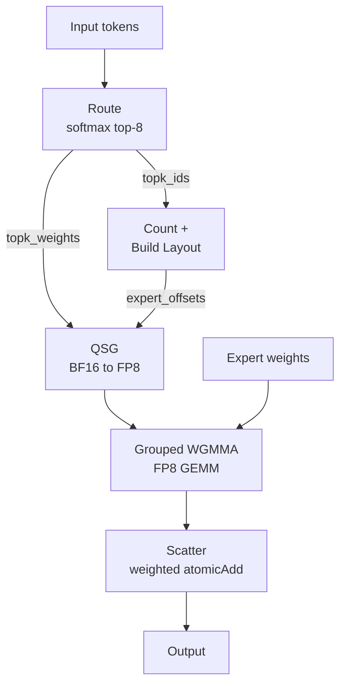
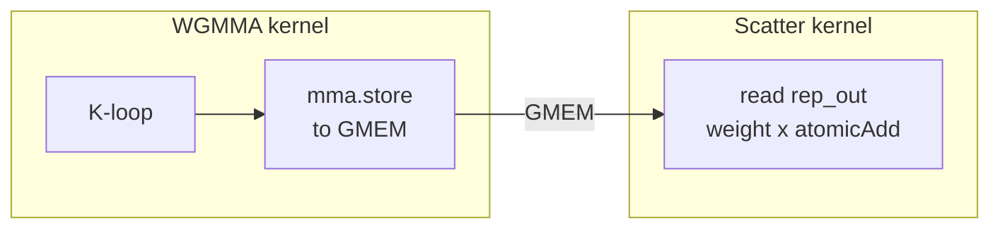

# Fused MoE FP8：8.09 → 13.18 TFLOPS（1.63×）

本教程逐步展示如何优化用 [鳄霸](https://codes1gn.github.io/croktile-tutorial/) 编写的 **fused Mixture-of-Experts（MoE）端到端 kernel**。目标 workload 来自真实推理场景 **Qwen3.5-35B-A3B**：每个 token 从 256 个 expert 中路由到 8 个。目标：在 NVIDIA H800 PCIe（SM90）上让整个流水线——路由、量化、grouped GEMM 与 scatter——尽可能快，且仅使用鳄霸 `.co` 源码。

### 流水线一览

与标准矩阵乘法不同，fused MoE kernel 是一组 **数据相关** 阶段的组合。下面是单次推理前向的完整路径：



grouped GEMM 通过 WGMMA 使用 FP8 Tensor Core，但在小 batch 下，周围的「胶水」——路由、量化、排序、scatter——占主导。256 个 expert、仅 128 个 token 时，多数 expert 大约只看到 ~4 个 token；真正的优化空间在这里。

### 优化路线图

| Stage | Milestone `.co` | TFLOPS | Key Idea |
|-------|----------------|-------:|--------|
| Baseline（7 个 kernel） | [`00_baseline.co`](../../optimization/assets/fused-moe-fp8/00_baseline.co) | 8.09 | 朴素流水线：route → count → build → quant → sort → WGMMA → scatter |
| **Phase 1：Kernel Fusion** | [`03_all_fusions.co`](../../optimization/assets/fused-moe-fp8/03_all_fusions.co) | 9.45 | 将 scatter 与 WGMMA 融合，quant+sort、count+build 融合 |
| **Phase 2–3：Host + Micro** | [`04_host_micro.co`](../../optimization/assets/fused-moe-fp8/04_host_micro.co) | 9.89 | `parallel.async`、CUDA Graphs、scatter 向量化、批量量化、`yield`、`mma.store` scatter |
| **Phase 4–5：Memory + Peripheral** | [`05_cuda_optimized.co`](../../optimization/assets/fused-moe-fp8/05_cuda_optimized.co) | **13.18** | Grid swap、L2 persist、QSG 流水线、prefix scan、`__cpp__` scatter |

---

## 问题：面向 Qwen3.5 的 Fused MoE

**Mixture-of-Experts（MoE）** 是一种稀疏化技术：每个 token 只路由到一小部分「expert」子网络。Qwen3.5-35B-A3B 的配置尤其激进：

| Parameter | Value | Notes |
|-----------|-------|-------|
| Tokens（M） | 128 | 典型推理 batch |
| Output dim（N） | 512 | Expert FFN 隐层宽度 |
| Input dim（K） | 2048 | Expert FFN 输入维度 |
| Experts | 256 | Expert 池规模偏大 |
| Top-K | 8 | 每 token 激活的 expert 数 |
| Precision | FP8（E4M3） | Blockwise 量化的输入与权重 |
| Block shape | 128×128 | FP8 量化粒度 |

单次前向的总 FLOPs：`2 × 128 × 8 × 512 × 2048 ≅ 2.15 GFLOP`。在 H800 上 FP8 WGMMA 理论峰值约 ~30 TFLOPS 时，理想耗时约 72µs；我们的 baseline 约 ~265µs，相对 roofline 存在 **3.7× 差距**——且与 dense GEMM 不同，仅靠更好 tiling 无法抹平。

难点在于：256 个 expert、仅 128 个 token 时，平均每个 expert 大约只有 4 个 token。grouped GEMM 的 tile 极小（4×512×2048），而 GEMM 周围的「胶水」——路由、量化、排序、scatter——在总时间中占比显著。这与优化大型 matmul 根本不同。

### 关于鳄霸

本文所有 kernel 代码均使用 **鳄霸的 `.co` 格式**编写——一种编译到 CUDA/CuTe C++ 的 C++ 嵌入式领域专用语言（EDSL）。你用鳄霸原语编写高层 GPU kernel，编译器生成优化后的 CUDA 代码。当 EDSL 尚不能表达某种模式时，`__cpp__("...")` 块可内嵌原始 CUDA——仍留在同一 `.co` 文件中，无需后处理。工作流为：

```
.co source  →  Croqtile compiler  →  .cute.result (CUDA C++)  →  nvcc  →  binary
```

本文每一项优化均可通过鳄霸编译器从 **`.co` 源码**复现，无需手工改生成 CUDA。绝大多数优化使用鳄霸原生原语；少数使用 `__cpp__` 逃生舱以覆盖语言尚未支持的模式（例如用于 L2 cache 控制的 `cudaAccessPolicyWindow` 或 128-bit SIMD store）。这些属于鳄霸语言的一部分，而非外部后处理。

---

## Baseline：7 个 kernel，8.09 TFLOPS

> **Source：** [`00_baseline.co`](../../optimization/assets/fused-moe-fp8/00_baseline.co) — 可从 `.co` 完全复现

Baseline 将 fused MoE 流水线实现为 **7 次独立的 kernel launch**：

```
route → count → build_layout → quantize → sort_gather → WGMMA → scatter
```

每次 launch 都有开销：TMA descriptor 创建、参数打包、以及 CPU-GPU 同步。此外，kernel 之间必须在 global memory 中物化中间 buffer。各 kernel 职责如下：

**1. Route**（`fused_moe_route`）——对 256 个 expert 做 softmax（含 softcapping / tanh），再通过 warp 级 shuffle 规约做 top-8。每个 token 由一个 warp（32 线程）处理全部 256 个 expert，每线程 8 个值。

**2. Count Experts**（`fused_moe_count_experts`）——M×topk 个线程各自对其对应 expert 的计数做 atomic increment。实现简单，但需要单独一次 launch。

**3. Build Layout**（`fused_moe_build_layout`）——对 expert 计数做 exclusive prefix sum，得到 expert offset。在 **单一线程** 上串行 O(256) scan。是的，就一个线程。

**4. Quantize Input**（`fused_moe_quantize_input`）——按 128 大小的 block 做 FP8 量化：跨 4 个 warp 用 warp shuffle 找最大绝对值，scale = max/448，再逐元素量化。

**5. Sort & Gather**（`fused_moe_sort_and_gather_quant_input`）——对每个 token 用 `atomicAdd` 分配 expert 槽位，再把量化数据拷到排序后的位置。

**6. Grouped WGMMA**（`fused_moe_grouped_wgmma_fp8`）——真正的 FP8 GEMM，使用 Hopper 的 Warp Group Matrix Multiply Accumulate。Grid 为 1024 个 CTA（256 experts × 4 N-blocks），每 CTA 128 线程。

**7. Scatter to Output**（`fused_moe_scatter_rows_to_output`）——从 global memory 读取 BF16 的 WGMMA 输出，乘以路由权重，再以加权 `atomicAdd` scatter 回原始 token 位置。

Baseline 的 host 代码在 `main()` 中顺序 launch 上述 7 个 kernel。在鳄霸中，`__co__` 函数像普通 C++ 函数一样调用——编译器生成 CUDA launch 封装：

```cpp
// Baseline main() — 7 kernel launches + 3 memsets
choreo::abend_true(cudaMemset(expert_counts_d, 0, ...));
choreo::abend_true(cudaMemset(output_d, 0, ...));

fused_moe_route(gating_d, topk_ids_d, topk_weights_d, expert_counts_d);
fused_moe_count_experts(topk_ids_d, expert_counts_d);
fused_moe_build_layout(expert_counts_d, expert_offsets_d, expert_write_offsets_d);
fused_moe_quantize_input(input_d, input_q_d, input_scales_d);
fused_moe_sort_and_gather_quant_input(
    input_q_d, input_scales_d, topk_ids_d,
    expert_write_offsets_d, sorted_route_ids_d, rep_a_q_d, rep_a_scales_d);
fused_moe_grouped_wgmma_fp8(
    rep_a_q_d, rep_a_scales_d, expert_weights_d,
    expert_scales_d, expert_offsets_d, rep_out_d);
fused_moe_scatter_rows_to_output(
    rep_out_d, sorted_route_ids_d, topk_weights_d, output_d);
```

下面是 baseline 的 `build_layout` kernel——单线程串行 prefix sum：

```co
__co__ void fused_moe_build_layout(
    global s32 [NUM_EXPERTS] expert_counts,
    global s32 [NUM_EXPERTS + 1] expert_offsets,
    global s32 [NUM_EXPERTS] expert_write_offsets) {
  parallel tid by NUM_EXPERTS : thread {
    inthreads (tid == 0) {
      s32 prefix = 0;
      expert_offsets.at(0) = 0;
      foreach expert in [NUM_EXPERTS] {
        s32 count = expert_counts.at(expert);
        expert_offsets.at(expert + 1) = prefix + count;
        expert_write_offsets.at(expert) = prefix;
        prefix = prefix + count;
      }
    }
  }
}
```

以及 WGMMA kernel——占 runtime 主体的 grouped GEMM：

```co
// Baseline: grouped WGMMA with separate mma.store to global memory
__co__ void fused_moe_grouped_wgmma_fp8(
    global f8_e4m3 [M, K] lhs, global f32 [M, K_BLOCKS] scale_a,
    global f8_e4m3 [EXPERT_N, K] rhs,
    global f32 [NUM_EXPERTS * N_BLOCKS, K_BLOCKS] scale_b,
    global s32 [NUM_EXPERTS + 1] expert_offsets,
    global bf16 [M, N] output) {

  parallel.async {eid, block_n}
      by [NUM_EXPERTS, cdiv(N, WARP_N)] : block
  parallel by 1 : group-4
  parallel t by 128 : thread {
    shared f8_e4m3 [WARP_M, TILE_K] sA;
    shared f8_e4m3 [WARP_N, TILE_K] sB;

    s32 seg_start = expert_offsets.at(eid);
    s32 seg_end   = expert_offsets.at(eid + 1);
    if (seg_end - seg_start <= 0) yield;

    foreach iv_m in [cdiv(seg_length, WARP_M)] {
      mc = mma.fill.f32 0.0f;
      foreach iv_k in [K_BLOCKS] {
        // LHS via cp.async DMA, RHS via TMA
        dma.copy.swiz<128>.zfill
            lhs.view(WARP_M, TILE_K).from(
                seg_start + iv_m * WARP_M, iv_k * TILE_K)
            => sA.subspan(tile_rows, TILE_K);
        tma.copy.swiz<128>
            rhs.subspan(WARP_N, TILE_K).at(eid # block_n, iv_k) => sB;

        foreach iv_warp in [TILE_K / WARP_K] {
          ma = mma.load.swiz<128> sA.chunkat(_, iv_warp);
          mb = mma.load.swiz<128> sB.chunkat(_, iv_warp);
          mma.row.row mc, ma, mb;
        }
        // FP8 blockwise scale: dual accumulator pattern
        mma.scale mc, scale_a.view(...).from(...), scale_b.at(...);
      }
      // Store to intermediate buffer — scatter is a SEPARATE kernel
      mma.store mc, output.view(tile_rows, WARP_N).from(...);
    }
  }
}
```
### 最快可能运行时间的下界

- **Compute：** 2.15 GFLOP，按 ~30 TFLOPS FP8 ≈ 72µs
- **Memory：** LHS：1024 行 × 2KB = 2MB。RHS：每 CTA 128×128 字节 × 16 个 K-block = 256KB（经 L2 在 CTA 间共享）。最小流量约 ~4MB，按 2TB/s ≈ 2µs。
- **真正的瓶颈** 既不是纯 compute 也不是纯 memory：而是每个 expert 的 tile 过小，以及周围 kernel 的开销。

---

## Phase 1：Kernel Fusion（8.09 → 9.45 TFLOPS）

> **Source：** [`01_scatter_fusion.co`](../../optimization/assets/fused-moe-fp8/01_scatter_fusion.co)、[`02_qsg_fusion.co`](../../optimization/assets/fused-moe-fp8/02_qsg_fusion.co)、[`03_all_fusions.co`](../../optimization/assets/fused-moe-fp8/03_all_fusions.co) — 可从 `.co` 完全复现

第一阶段主要优化目标是把 7 个 kernel 减到更少、已融合的 kernel。每次融合都会削减 launch 开销、`cudaDeviceSynchronize()` 调用，以及中间 global memory 流量。

### Fusion 1：Scatter 并入 WGMMA · iter007 · 8.22 TFLOPS（+1.6%）

Baseline 将 WGMMA 与 scatter 作为 **两个独立 kernel** 运行，中间经历一次 global memory 往返：



WGMMA kernel 先把结果写到 global 的 `rep_out`，再由单独的 scatter kernel 读回、乘以路由权重并对最终输出做 `atomicAdd`。代价是一次完整 launch，外加 global 写/读往返。

**Before — baseline WGMMA epilogue** 写到中间 global buffer：

```co
// Baseline WGMMA: store result to global memory
// A separate scatter kernel will read this later
      mma.store mc, output.view(tile_rows, WARP_N).from(...);
    }  // end foreach iv_m
  }
}

// Separate scatter kernel — reads WGMMA output back from global memory
__co__ void fused_moe_scatter_rows_to_output(
    global bf16 [MAX_SORTED_ROUTES, N] rep_out,
    global s32 [MAX_SORTED_ROUTES] sorted_route_ids,
    global f32 [M, TOPK] topk_weights,
    global f32 [M, N] output) {
  parallel sorted_row by M * TOPK : block {
    route_id = sorted_route_ids.at(sorted_row);
    token = route_id / TOPK;
    weight = topk_weights.at(token, route_id % TOPK);
    parallel lane by WARP_N : thread {
      foreach block_n in [cdiv(N, WARP_N)] {
        out_col = block_n * WARP_N + lane;
        val = rep_out.at(sorted_row, out_col) * weight;
        call ATOMIC_ADD(&output.at(token, out_col), val);
      }
    }
  }
}
```

**After — fused epilogue** 将 `mma.store → GMEM` 换成 `mma.store → shared`，并在同一 kernel 内直接 scatter：

```co
// Fused WGMMA+scatter: store to shared, scatter to output in one kernel
// Replaces both the GMEM store AND the separate scatter kernel
      shared f32 [WARP_M, WARP_N] sOut;
      mma.store mc, sOut;
      sync.shared;

      foreach local_row in [WARP_M] {
        if (local_row < tile_rows) {
          s32 actual_row = seg_start + iv_m * WARP_M + local_row;
          s32 route_id = sorted_route_ids.at(actual_row);
          s32 token = route_id / TOPK;
          s32 selected = route_id % TOPK;
          f32 weight = topk_weights.at(token, selected);
          f32 val = sOut.at(local_row, t) * weight;
          call ATOMIC_ADD(&scatter_output.at(token, block_n * WARP_N + t), val);
        }
      }
    }  // end foreach iv_m
  }
}
```

融合版本纯鳄霸原生实现，无需 `__cpp__`。`mma.store` 处理硬件相关的累加器 fragment 布局，`foreach` + `call ATOMIC_ADD` 循环也很直接。数据从 MMA 寄存器 → shared memory → global output，全程不经过 DRAM 上的中间 `rep_out` buffer。

后续迭代（iter014）进一步通过 `__cpp__` 直接访问 MMA 寄存器，去掉 shared staging——但此处展示的原生版本是更简单的起点。

仅 scatter 融合带来的提升约 +1.6%，因为此阶段 scatter 尚不在关键路径上。但它消除了中间 `rep_out` buffer 与一次完整 kernel launch；与其它融合组合后收益才明显。

### Fusion 2：Quantize + Sort → 单一 QSG kernel · iter009 · 8.92 TFLOPS（+8.5%）

quantize 与 sort-gather 两个 kernel 都会遍历全部 M 个 token。将它们融合为单个 kernel（QSG — Quantize, Sort, Gather）可省掉一次 kernel launch，以及中间的 `input_q` 全局内存缓冲。每个 block 对一个 token 分三阶段处理：经 shared memory 量化为 FP8，用 atomicAdd 分配排序后的槽位，再把量化后的数据拷到排序后的位置。

```co
__co__ void fused_moe_quant_sort_gather(
    global bf16 [M, K] input,
    global s32 [M, TOPK] topk_ids,
    global s32 [NUM_EXPERTS] expert_write_offsets,
    global s32 [MAX_SORTED_ROUTES] sorted_route_ids,
    global f8_e4m3 [MAX_SORTED_ROUTES, K] rep_a_q,
    global f32 [K_BLOCKS, MAX_SORTED_ROUTES] rep_a_scales) {
  parallel token by M : block {
    shared f32 [4] warp_max;
    shared f8_e4m3 [K] sq;          // quantized row in smem
    shared f32 [K_BLOCKS] ss;       // per-block scales
    shared s32 [TOPK] route_slots;
    parallel lane by 128 : thread {
      // Phase 1: Quantize BF16 → FP8 via shared memory
      foreach block_k in [K_BLOCKS] {
        kk = block_k * BLOCK_K + lane;
        f32 value = input.at(token, kk);
        // warp-shuffle reduction for block max ...
        f32 inv_scale = 1.0f / ss.at(block_k);
        sq.at(kk) = value * inv_scale;  // FP8 quantize
      }
      sync.shared;
      // Phase 2: Assign sorted slots via atomicAdd
      inthreads (lane == 0) {
        foreach selected in [TOPK] {
          expert = topk_ids.at(token, selected);
          s32 slot = call ATOMIC_ADD(
              &expert_write_offsets.at(expert), 1);
          route_slots.at(selected) = slot;
          sorted_route_ids.at(slot) = token # selected;
        }
      }
      sync.shared;
      // Phase 3: Copy quantized data to sorted positions
      foreach selected in [TOPK] {
        s32 slot = route_slots.at(selected);
        foreach block_k in [K_BLOCKS] {
          kk = block_k * BLOCK_K + lane;
          if (lane < K_BLOCKS && block_k == 0)
            rep_a_scales.at(lane, slot) = ss.at(lane);
          if (kk < K) rep_a_q.at(slot, kk) = sq.at(kk);
        }
      }
    }
  }
}
```

### Fusion 3：Count + Build Layout · iter017–018 · 9.45 TFLOPS（+5.9%）

`count_experts` 与 `build_layout` 两个 kernel 很小——只是对 expert 分配做计数与前缀和。将它们融合为 `fused_moe_count_and_build`，并用 shared memory 上的 atomics，可省掉一次 kernel launch，以及原先夹在两者之间的 `cudaDeviceSynchronize` + `cudaMemset`：

```co
__co__ void fused_moe_count_and_build(
    global s32 [M, TOPK] topk_ids,
    global s32 [NUM_EXPERTS + 1] expert_offsets,
    global s32 [NUM_EXPERTS] expert_write_offsets) {
  parallel tid by NUM_EXPERTS : thread {
    shared s32 [NUM_EXPERTS] s_counts;
    shared s32 [NUM_EXPERTS + 1] s_offsets;

    s_counts.at(tid) = 0;
    sync.shared;

    // Count: each thread strides over all M*TOPK assignments
    foreach i in [cdiv(M * TOPK, NUM_EXPERTS)] {
      s32 idx = tid + i * NUM_EXPERTS;
      if (idx < M * TOPK) {
        s32 expert = topk_ids.at(idx / TOPK, idx % TOPK);
        call ATOMIC_ADD(&s_counts.at(expert), 1);
      }
    }
    sync.shared;

    // Prefix sum (single thread, 256 experts)
    inthreads (tid == 0) {
      s32 prefix = 0;
      s_offsets.at(0) = 0;
      foreach expert in [NUM_EXPERTS] {
        s32 count = s_counts.at(expert);
        s_offsets.at(expert + 1) = prefix + count;
        prefix = prefix + count;
      }
    }
    sync.shared;

    expert_write_offsets.at(tid) = s_offsets.at(tid);
    expert_offsets.at(tid) = s_offsets.at(tid);
  }
}
```

这是纯原生鳄霸写法——256 个线程各自用 `foreach` 在展平后的 `M*TOPK` 数组上跨步遍历，把对 expert 分配的计数原子累加到 shared memory，再由 thread 0 做串行前缀和。

### 编译器选项：容易拿到的收益 · iter015–019

这些 flag 在编译期生效。在 Phase 1 里程碑上影响很小（[03_all_fusions.co](../../optimization/assets/fused-moe-fp8/03_all_fusions.co) 有 flag：9.47，无 flag：9.45，约 +0.2%），但在后续阶段 WGMMA kernel 主导运行时间后，差异会明显起来：

| Flag | 作用 | Δ（原始 A/B） |
|------|--------|---|
| `--use_fast_math` | routing softmax 中更快的 expf/divf，FTZ 模式 | +0.5% |
| `--disable-runtime-check` | 去掉 `choreo_assert()` 的函数边界，避免拖住 WGMMA 流水 | +2.4% |
| `--hoist-offset --hoist-scale` | 把 K 循环中不变的地址/scale 计算提到循环外 | +0.9% |
| 转置 `rep_a_scales` 布局 | WGMMA 合并读：[routes, K_blocks] → [K_blocks, routes] | +1.3% |

!!! info "关于 `--disable-runtime-check`"
    鳄霸编译器会插入 `choreo_assert()` 做边界检查。在 GPU 上，这些会形成函数调用边界，使 `ptxas` 无法把 WGMMA 指令跨循环迭代调度（会报 C7510："register-register dependency for WGMMA"）。去掉它们带来了约 2.4% 的意外提速。教训：编译器基础设施可能在不知不觉中破坏 GPU 指令流水。

这一阶段之后，serving 路径上的流水线只剩 **4 个 kernel**（graph capture 路径里为 3 个）：

```
route → count+build → QSG → WGMMA+scatter
```

---

## Phase 2：Host 流水线与 CUDA Graph（9.45 → 9.89 TFLOPS）

> **来源：** [`04_host_micro.co`](../../optimization/assets/fused-moe-fp8/04_host_micro.co) —— 测得 **9.89 TFLOPS**。该里程碑还包含 Phase 3 的微优化（local 数组、yield、mma.store scatter）。

### 去掉 Host-Device 同步 · iter021–023 · +4.7%

这是 kernel fusion 之后单次提升最大的一项，来源却出乎意料地平常。

在 `.co` 源码里，改动只是一个关键字：把 kernel 顶层分解里的 `parallel` 改成 `parallel.async`：

```co
// Before: plain parallel — compiler emits cudaDeviceSynchronize after launch
__co__ void fused_moe_quant_sort_gather(...) {
  parallel token by M : block {
    // ...
  }
}

// After: parallel.async — compiler omits the sync
__co__ void fused_moe_quant_sort_gather(...) {
  parallel.async token by M : block {
    // ...
  }
}
```

这一个关键字影响的是**生成的 CUDA wrapper**——编译器不再在 kernel launch 之后发出 `cudaDeviceSynchronize()`：

```cpp
// Generated WITHOUT parallel.async:
void launch_fused_moe_qsg(...) {
  fused_moe_qsg_kernel<<<grid, block>>>(...);
  cudaDeviceSynchronize();  // BLOCKS CPU for ~30us!
}

// Generated WITH parallel.async:
void launch_fused_moe_qsg(...) {
  fused_moe_qsg_kernel<<<grid, block>>>(...);
  // CPU immediately returns to submit next kernel
}
```

!!! success "结果"
    去掉各次 kernel launch 之间的 host-device 同步带来 +4.7%。CPU 每个 kernel 会阻塞约 30µs——每轮迭代三次。教训：*除非确实需要结果，否则不要在同一 stream 上两次 launch 之间阻塞 CPU。* 在鳄霸里，`parallel.async` 让这件事几乎零成本。

### CUDA Graph · iter024–025 · +2.2%

serving 路径上只有 3 个 kernel（count_and_build、QSG、WGMMA）时，在这种亚 200µs 的时间尺度上，launch 开销仍然可观。CUDA Graph 把整个 3-kernel 序列 capture 下来，用单次 `cudaGraphLaunch` 重放，省掉每个 kernel 在 CPU 侧打包参数和重建 TMA descriptor 的开销：

```cpp
// In main() — define the serving-path as a lambda
auto launch_serving_path = [&]() {
  choreo::abend_true(cudaMemsetAsync(
      output_d, 0, M * N * sizeof(float), 0));

  fused_moe_count_and_build(
      topk_ids_d_view, expert_offsets_d_view,
      expert_write_offsets_d_view);
  fused_moe_quant_sort_gather(
      input_d_view, topk_ids_d_view,
      expert_write_offsets_d_view,
      sorted_route_ids_d_view,
      rep_a_q_d_view, rep_a_scales_d_view);
  fused_moe_grouped_wgmma_fp8(
      rep_a_q_d_view, rep_a_scales_d_view,
      expert_weights_d_view, expert_scales_d_view,
      expert_offsets_d_view, sorted_route_ids_d_view,
      topk_weights_wgmma_view, output_d_view);
};

// Capture as CUDA Graph for zero-overhead replay
cudaGraph_t serving_graph;
cudaGraphExec_t serving_graph_exec;
cudaStreamBeginCapture(cudaStreamPerThread,
    cudaStreamCaptureModeThreadLocal);
launch_serving_path();
choreo::abend_true(cudaStreamEndCapture(
    cudaStreamPerThread, &serving_graph));
choreo::abend_true(cudaGraphInstantiate(
    &serving_graph_exec, serving_graph, nullptr, nullptr, 0));

// Each iteration: single launch replays all 3 kernels
cudaGraphLaunch(serving_graph_exec, cudaStreamPerThread);
```

注意鳄霸特有的写法：C++ host 代码里直接调用 `__co__` 函数。鳄霸编译器会生成 CUDA wrapper，因此 host 侧读起来像普通函数调用，而 grid/block 配置由编译器处理。

!!! info "CUDA Graph 注意点"
    Graph 需要 `--default-stream per-thread` 编译选项。另外，graph 里若有 `cudaMemsetAsync` 节点会有固定开销——我们通过把最后的 memset 融进 QSG kernel 来去掉它。

---

## Phase 3：微优化（计入 Phase 2 里程碑 · 9.89 TFLOPS）

> **来源：** 微优化包含在 [`04_host_micro.co`](../../optimization/assets/fused-moe-fp8/04_host_micro.co)（9.89 TFLOPS）中。下面各项最初是按 A/B 差值测的。

到这一步，低垂的果实已经摘完。接下来 16 轮迭代（iter026–040）总共挤出约 2.7%；多数尝试持平或更差。下面是留下来的几项：

### QSG scatter 向量化 · iter034 · +0.77%

QSG kernel 的输出拷贝循环按元素写 FP8——每个线程每个 K-block 16 次 store。改用 16 字节 store 向量化后，128 条 store 指令减到 8 条：

```co
// Before: byte-by-byte FP8 copy to sorted positions
foreach block_k in [K_BLOCKS] {
  kk = block_k * BLOCK_K + lane;
  if (kk < K) rep_a_q.at(slot, kk) = sq.at(kk);  // 1-byte store ×128
}

// After: 16-byte vectorized copy (uint4)
// Each thread copies 16 consecutive FP8 values in one store
foreach block_k in [K_BLOCKS] {
  __cpp__("  *(uint4*)&rep_a_q[slot*K + block_k*128 + lane*16]");
  __cpp__("    = *(uint4*)&sq[block_k*128 + lane*16];\n");
}
```

### 批量量化 · iter037 · +1.1%

基线 QSG 一次只量化一个 K-block，每个 block 的 load → max-reduce → quantize 之间都要 `sync.shared`（共 48 次 sync）。改法：先把全部 16 个输入值载入 `local` 寄存器，在寄存器上算完 16 个 warp-max，再一次性量化：

```co
// Before: per-K-block quantize (3 syncs × 16 blocks = 48 syncs)
foreach block_k in [K_BLOCKS] {
  f32 value = input.at(token, kk);     // load
  // warp shuffle max-reduce...
  sync.shared;                         // sync for scale
  sq.at(kk) = value * inv_scale;       // quantize
  sync.shared;                         // sync for next block
}

// After: batch all loads, then all reductions, then all quantizations
local f32 [K_BLOCKS] vals;
foreach k in [K_BLOCKS] {
  vals.at(k) = input.at(token, k * BLOCK_K + lane);  // all loads issued
}
// warp shuffle max-reduce on vals[0..15] — no syncs needed between blocks
// then quantize all 16 blocks from registers
// Sync count: 48 → 7
```

!!! info "平台期是真实存在的"
    在 iter026 到 iter040 之间我试过：K 循环 load 重排（持平）、删掉未用 shared memory（持平）、maxrregcount=128（-4.4%）、K 循环展开（持平）、ptxas opt-level=4（持平）、K 循环双缓冲（-6.8%）、两个矩阵都用 TMA（-0.5%）、`__launch_bounds__`（持平）、red.relaxed epilogue（持平）、swizzle-64（崩溃）。WGMMA kernel 约 77.8% DRAM 吞吐，168 个寄存器，每 SM 3 个 CTA。没有哪项微优化能突破这层天花板。

---

## Phase 4：内存层次（9.89 → 13.18 TFLOPS，与 Phase 5 合并统计）

> **来源：** [`05_cuda_optimized.co`](../../optimization/assets/fused-moe-fp8/05_cuda_optimized.co) — 测得 **13.18 TFLOPS**。该里程碑包含 Phase 4 与 Phase 5 的全部优化。Grid swap 使用原生 `parallel` 重排；L2 persistence 通过 host 侧 `__cpp__` 块调用 `cudaAccessPolicyWindow` 实现。

Phase 3 之后，WGMMA kernel 已牢牢卡在约 78% 的 DRAM 吞吐上，微观指令级优化难以突破。后续收益来自更聪明地利用内存层次 —— 具体而言，是让 GPU 的 L2 cache 多干活。

### TMA/DMA 重叠 · iter046 · +1.14%

WGMMA kernel 使用两套不同的访存引擎：**TMA**（Tensor Memory Accelerator，专用硬件单元）负责 RHS 权重矩阵，**DMA**（经 LSU 流水线的 `cp.async`）负责 LHS 激活。把 K 循环重排为先发起 TMA 拷贝、再发起 DMA 拷贝，两套硬件可并行工作。

!!! info "为什么不用 TMA 搬两边矩阵？"
    我试过（iter049、iter091），都回退约 1%。原因是：A、B 都用 TMA 时，会串行争用*同一个 TMA 引擎*；一侧用 DMA（`cp.async`）时，走*不同硬件通路*（LSU 对 TMA 引擎），才能真正并行。这里非对称更好。

### Grid Swap · iter051 · +2.0%

一个看似简单但影响很大的改动：把 WGMMA grid 维度从 `(256, 4)` 换成 `(4, 256)`。

```
Before: grid (256, 4) — consecutive blocks = different experts
Block scheduler assigns:  (0,0) (1,0) (2,0) (3,0) ... (255,0) (0,1) ...
                           eid=0 eid=1 eid=2 eid=3       eid=255
                           ↓     ↓     ↓     ↓           ↓
                           LHS₀  LHS₁  LHS₂  LHS₃       LHS₂₅₅
                           ALL DIFFERENT — L2 thrashing!

After: grid (4, 256) — consecutive blocks = same expert, different N-tiles
Block scheduler assigns:  (0,0) (1,0) (2,0) (3,0) (0,1) (1,1) ...
                           n=0   n=1   n=2   n=3   n=0   n=1
                           eid=0 eid=0 eid=0 eid=0 eid=1 eid=1
                           ↓     ↓     ↓     ↓
                           LHS₀  LHS₀  LHS₀  LHS₀  ← SHARED in L2!
```

CUDA block 调度器会把连续的 `blockIdx` 派到同一块 SM。交换 grid 后，同一 expert 的 4 个 N-tile block 会一起跑，在 L2 中复用同一份 LHS 数据。在鳄霸里，这只需改一行 —— 交换 `parallel` 分解的顺序：

```co
// Before: (256, 4) — expert-major
parallel.async {eid, block_n} by [NUM_EXPERTS, cdiv(N, WARP_N)] : block

// After: (4, 256) — N-tile-major → same expert's blocks colocated
parallel.async {block_n, eid} by [cdiv(N, WARP_N), NUM_EXPERTS] : block
```

### L2 Persistence · iter052 · +1.6%

用 `cudaAccessPolicyWindow` 且 `hitProp=Persisting`，把 LHS 矩阵（`rep_a_q_d`，约 2MB）钉在 L2 cache 中。

!!! success "合并效果"
    Grid swap（+2.0%）+ L2 persistence（+1.6%）≈ 合计 **3.6%**。两项优化都直接写在 `.co` 源码里。

---

## Phase 5：周边 kernel 优化（计入 Phase 4 里程碑 · 13.18 TFLOPS）

> **来源：** [`05_cuda_optimized.co`](../../optimization/assets/fused-moe-fp8/05_cuda_optimized.co) — 测得 **13.18 TFLOPS**。通过 `local` 数组做 load pipelining、并行 prefix scan，以及对 count 的 load 做流水化。

WGMMA kernel 已贴近 DRAM 吞吐天花板，GEMM 本身再难挖。但 QSG 与 count_and_build 仍有空间。优化重心从「主角」转向「配角」。原生鳄霸构造 —— 用 `local` 数组做寄存器缓冲、`foreach` 做并行扫描、`call ATOMIC_ADD` 做 shared-memory 原子 —— 承担了大部分工作。

### QSG Load Pipelining · iter065 · +1.97%

QSG kernel 的量化循环原先按 K-block 逐个 load 输入，每次归约前都在 DRAM 延迟上空转。把 load 阶段与归约阶段拆开，可启用 **memory-level parallelism** —— 16 次 DRAM load 可同时在路上：

```co
// Before (baseline QSG): serial load-reduce per K-block
foreach block_k in [K_BLOCKS] {           // 16 iterations
    f32 value = input.at(token, kk);      // DRAM stall ~400 cycles!
    // warp shuffle reduction...
    sync.shared;                           // blocked until load done
}

// After: load ALL 16 values into local registers first, then reduce
local f32 [K_BLOCKS] vals;
foreach k in [K_BLOCKS] {
  vals.at(k) = input.at(token, k * BLOCK_K + lane);
}
// Now all 16 loads are in the memory pipeline simultaneously
// Reduce from registers — no DRAM stalls between iterations
foreach block_k in [K_BLOCKS] {
    f32 value = vals.at(block_k);
    // warp shuffle reduction for block max, then quantize...
}
```

!!! success "结果"
    仅 QSG load pipelining 就带来 **+1.97%**。该技术把大部分约 400 cycle 的 DRAM 延迟藏在 16 个未决访存请求背后。在鳄霸中，`local` 数组映射到寄存器，编译器会在任何归约开始前先把 load 都发出去。

### Parallel Slot Assignment · iter066 · +1.24%

基线 QSG 由 thread 0 顺序执行 8 次 `atomicAdd` 分配 expert slot。修复：thread 0–7 各处理一条选择，并行完成，把 slot 分配从约 800 cycle 降到约 100 cycle。

### Parallel Hillis-Steele Prefix Scan · iter067 · +0.34%

把 count_and_build 里仅 thread 0 跑的串行 O(256) prefix sum，换成 **256 线程并行 inclusive scan**，用 Hillis-Steele 算法，O(log 256) = 8 步：

```co
// Before: single-threaded serial prefix sum (thread 0 does all 256 iterations)
inthreads (tid == 0) {
  s32 prefix = 0;
  foreach expert in [NUM_EXPERTS] {
    s_offsets.at(expert + 1) = prefix + s_counts.at(expert);
    prefix = prefix + s_counts.at(expert);
  }
}

// After: 256-thread parallel Hillis-Steele inclusive scan
s_offsets.at(tid) = s_counts.at(tid);
sync.shared;
foreach step in [8] {
  s32 stride = 1 << step;
  s32 val = s_offsets.at(tid);
  if (tid >= stride)
    val = val + s_offsets.at(tid - stride);
  sync.shared;
  s_offsets.at(tid) = val;
  sync.shared;
}
// s_offsets now holds inclusive prefix sums; shift right by 1 for exclusive
```

### Pipelined topk_ids Loads · iter068 · +0.65%

在 count_and_build 中，先把 topk_ids 全部 batch load 到 `local` 寄存器，再执行 atomicAdds。原则与 QSG load pipelining 相同 —— 利用 memory-level parallelism：

```co
// Before: interleaved load + atomicAdd per iteration
foreach i in [cdiv(M * TOPK, NUM_EXPERTS)] {
  s32 idx = tid + i * NUM_EXPERTS;
  if (idx < M * TOPK) {
    s32 expert = topk_ids.at(idx / TOPK, idx % TOPK);  // DRAM stall!
    call ATOMIC_ADD(&s_counts.at(expert), 1);
  }
}

// After: load all IDs first, then count
local s32 [4] ids;  // M*TOPK/NUM_EXPERTS = 1024/256 = 4
foreach i in [4] {
  s32 idx = tid + i * NUM_EXPERTS;
  ids.at(i) = topk_ids.at(idx / TOPK, idx % TOPK);
}
foreach i in [4] {
  call ATOMIC_ADD(&s_counts.at(ids.at(i)), 1);
}
```

### Scale Load Overlap · iter069 · +0.41%

在 WGMMA K 循环中，把 `scale_a`、`scale_b` 的 DRAM 读从 TMA wait 之后，挪到 DMA 完成与 TMA barrier wait 之间，用进行中的 TMA 传输掩盖 scale load 延迟。

### QSG Thread Scaling: 128 → 512 · iter079–080 · +1.70%

原 QSG kernel 每 block 128 线程（1 个 warp group）。在 Qwen3.5 规模（128 blocks）下，occupancy 仅约 6.25%。先倍增到 256 再到 512，occupancy 逐步提升到 25%。

### Fused Memset · iter099 · +0.71%

让每个 QSG 线程在 kernel 开头清零一个输出 float，从而从 CUDA Graph 中去掉 `cudaMemsetAsync(output_d)` 节点。

### Register-Direct Scatter Epilogue（`__cpp__`）· iter014 · +16.8%

消除 `mma.store` 与 `sync.shared` barrier 上的 shared-memory bank conflict：直接从寄存器读 MMA accumulator fragment。在完整优化后的 [`05_cuda_optimized.co`](../../optimization/assets/fused-moe-fp8/05_cuda_optimized.co) kernel 上测得：带 `__cpp__` scatter **13.18 TFLOPS**，原生 `mma.store` scatter **11.28 TFLOPS**（**+16.8%**）。更早迭代里增益 <1%，因为 K 循环占主导；在 grid swap、L2、QSG pipelining 等内存侧优化缩短 K 循环时间后，epilogue 成为显著瓶颈。

原生鳄霸 scatter（[`04_host_micro.co`](../../optimization/assets/fused-moe-fp8/04_host_micro.co)）走 shared memory：

```
MMA accumulators → mma.store → shared memory → sync.shared → foreach scatter → atomicAdd
```

`__cpp__` scatter（[`05_cuda_optimized.co`](../../optimization/assets/fused-moe-fp8/05_cuda_optimized.co)）通过直接访问 MMA accumulator fragment 寄存器，完全绕过 shared memory：

```
MMA accumulators → __cpp__ register read → atomicAdd (no shared memory, no sync)
```

**之前 — 原生鳄霸（[04_host_micro.co](../../optimization/assets/fused-moe-fp8/04_host_micro.co)）：**

```co
// mma.store dumps accumulators to shared, then foreach scatters
shared f32 [WARP_M, WARP_N] sOut;
mma.store mc, sOut;
sync.shared;

foreach local_row in [WARP_M] {
  if (local_row < tile_rows) {
    s32 actual_row = seg_start + iv_m * WARP_M + local_row;
    s32 route_id = sorted_route_ids.at(actual_row);
    s32 token = route_id / TOPK;
    f32 weight = topk_weights.at(token, route_id % TOPK);
    f32 val = sOut.at(local_row, t) * weight;
    call ATOMIC_ADD(&scatter_output.at(token, block_n * WARP_N + t), val);
  }
}
```

**之后 — `__cpp__` 寄存器直连（[05_cuda_optimized.co](../../optimization/assets/fused-moe-fp8/05_cuda_optimized.co)）：**

```co
// Access MMA accumulator fragments directly via __cpp__
// mc[] is the compiler-generated accumulator array (64 floats per thread)
__cpp__("  warpgroup_commit_batch();\n");
__cpp__("  warpgroup_wait<0>();\n");
__cpp__("  {\n");
__cpp__("    int itd = threadIdx.x & 127;\n");
__cpp__("    int lane = itd & 31;\n");
__cpp__("    int warp = itd >> 5;\n");
__cpp__("    int row0 = warp * 16 + (lane >> 2);\n");
__cpp__("    int row1 = row0 + 8;\n");
__cpp__("    auto do_scatter_row = [&](int local_row, int frag_off) {\n");
__cpp__("      if (local_row >= tile_rows) return;\n");
__cpp__("      int actual_row = seg_start + iv_m * 64 + local_row;\n");
__cpp__("      int route_id = sorted_route_ids[actual_row];\n");
__cpp__("      float weight = topk_weights[route_id / 8 * 8 + route_id % 8];\n");
__cpp__("      for (int c = 0; c < 16; c++) {\n");
__cpp__("        int col0 = c * 8 + (itd & 3) * 2;\n");
__cpp__("        float v0 = mc[c * 4 + frag_off] * weight;\n");
__cpp__("        float v1 = mc[c * 4 + frag_off + 1] * weight;\n");
__cpp__("        atomicAdd(&scatter_output[out_base + col0], v0);\n");
__cpp__("        atomicAdd(&scatter_output[out_base + col0 + 1], v1);\n");
__cpp__("      }\n");
__cpp__("    };\n");
__cpp__("    do_scatter_row(row0, 0);\n");
__cpp__("    do_scatter_row(row1, 2);\n");
__cpp__("  }\n");
```

该优化需要理解 WGMMA accumulator fragment 布局：128-thread warp group 中每个线程在 `mc[]` 里拥有 64 个 float，排成 16 列 × 4 个 fragment slot。`__cpp__` 代码把 thread ID 映射到行列位置，并在正确偏移读取 fragment。这天然是 `__cpp__` 模式 —— fragment 布局与硬件强相关，无法用原生鳄霸表达。

!!! info "为何重要"
    原生版本需要 `64×128 × 4B = 32KB` shared memory 存输出 tile，外加 `sync.shared` barrier。寄存器直连版本 epilogue 不占 shared memory、也无同步。在每 SM 3 个 CTA、64KB shared memory 预算下，腾出 32KB 可为其它 shared buffer 留余地。

!!! success "最终结果"
    **13.18 TFLOPS** — 相对基线 **1.63×**。由 [`05_cuda_optimized.co`](../../optimization/assets/fused-moe-fp8/05_cuda_optimized.co) 测得，鳄霸编译器编译，无需 CUDA 后处理。H800 PCIe 上 500 次重复计时确认。

---

## 无效尝试：一墙负结果

99 次迭代里，**59 次被丢弃**。命中率从前 20 次迭代的约 50%，掉到最后 60 次的约 10%。

### Double-Buffering：总是更差

| 尝试 | Δ | 失败原因 |
|---------|---|---------------|
| K-loop double-buffer (iter032) | -6.8% | Register pressure 168→186，3→2 CTAs/SM。Occupancy 损失 >> 重叠收益。 |
| TMA double-buf sB (iter071) | -9.3% | 5 CTAs×40KB SMEM 仅剩 28KB L1（对比 108KB）。对 cp.async 的 L1 hit rate 打击巨大。 |
| sB-only double-buf (iter054) | -2.9% | 同类 L1 压力机制。 |

### Occupancy 技巧：收益递减

| 尝试 | Δ | 失败原因 |
|---------|---|---------------|
| maxrregcount=128 (iter004b, iter028) | -4.4% | Register spill 到 local memory 的伤害大于 occupancy 收益。 |
| \_\_launch\_bounds\_\_(128,4) (iter075) | -0.7% | Occupancy 降低（5→4 CTAs）损害 DRAM 吞吐。 |
| WGMMA 64×64 tiles (iter057, iter094) | -4.0% | CTA 数量与 TMA 操作翻倍，盖过 occupancy 好处。 |

### Warp Specialization 与 Persistence：开销过大

| 尝试 | Δ | 失败原因 |
|---------|---|---------------|
| Warp-spec 1p1c (iter005) | -12% | Producer 开销相对小 K 循环（16 次迭代）过高。 |
| Persistent kernel (iter047, iter084) | -1.7% | 每 work item 的 atomic work-stealing + \_\_syncthreads >> 尾部 wave 节省。 |
| Grid-level QSG+count fusion (iter038) | -6.2% | Grid-level atomic 自旋等待开销远大于省下的 kernel launch 成本。 |

### 最长平台期：iter052–065

L2 persistence（iter052）之后，我连续 **13 次迭代**（iter053–064）试图继续推 WGMMA kernel，**全部**持平或回退：

- Scale caching across K-iterations（+0.15%，噪声）
- K-loop branch normalization（+0.17%，噪声）
- Hoisted WGMMA descriptors（+0.11%，噪声）
- K-loop #pragma unroll 2（+0.15%，噪声）
- PTX mbarrier.try\_wait spin-wait（+0.07%，噪声）
- RED.relaxed epilogue（-0.05%，噪声）
- Barrier count reduction 128→1（-0.17%，噪声）
- Combined micro-opts（+0.26%，噪声）
- Software-pipelined TMA（+0.12%，噪声）

每次尝试都用 3×500-rep A/B 测试（p < 0.05）。

!!! failure "最难的一课"
    WGMMA kernel 已顶在 DRAM 吞吐天花板（85%）。无论指令调度、barrier 微调还是微架构小花招，都无法再从内存子系统榨出更多带宽。*唯一*出路是优化*其它* kernel —— Phase 5 做的正是这件事。

---

## 鳄霸能表达什么

本文每项优化都写在 `.co` 源码里。但代码混合了**原生鳄霸原语**与 **`__cpp__` 逃生舱块**：

| 优化 | 影响 | 表达方式 |
|-------------|--------|-------------------|
| Kernel fusion（scatter、QSG、count+build） | +48% | **NATIVE** — 重组 kernel 函数、合并数据流 |
| `parallel.async`（去掉 cudaDeviceSynchronize） | +4.7% | **NATIVE** — 单关键字：`parallel.async` |
| CUDA Graphs | +2.2% | **NATIVE** — host `main()` 里的 CUDA API 调用 |
| Compiler flags（`--use_fast_math`、`--hoist-*`） | +5.1% | **NATIVE** — 编译器命令行参数 |
| Batched quantization、vectorized scatter | +1.9% | **NATIVE** — `local` 数组、`foreach` 重构 |
| Grid swap | +2.0% | **NATIVE** — 交换 `parallel` 分解顺序 |
| Parallel 8-thread slot assignment | +1.3% | **NATIVE** — `inthreads (lane < 8)` 并行循环 |
| QSG load pipelining | +2.0% | **NATIVE** — `local` 数组寄存器缓冲、`foreach` 批量 load |
| Parallel Hillis-Steele prefix scan | +0.3% | **NATIVE** — `foreach` + shared memory scan，每步 `sync.shared` |
| Pipelined topk_ids loads | +0.7% | **NATIVE** — `local` 数组在 atomicAdds 前批量 load |
| L2 persistence | +1.6% | host `main()` 中 `__cpp__` 块调用 `cudaAccessPolicyWindow` |
| Scatter epilogue（register-direct） | part of fusion | `__cpp__` 块直接触及 MMA accumulator 寄存器 |
| `uint4` vectorized FP8 copy | +0.8% | `__cpp__` 块 — 鳄霸无 128-bit SIMD 类型 |

!!! info "`__cpp__` 的角色"
    逃生舱是刻意的语言特性，不是凑合方案。它让你能用 GPU 专用写法（如 `__ldg` 只读 cache hint、warp 级 `__shfl_xor_sync`）而无需等编译器加原生支持。关键：一切仍在 `.co` 文件里。用鳄霸编译器编译一次，生成的 CUDA 会原样包含你的 `__cpp__` 代码。

### 原生 vs `__cpp__`：取舍

优先用原生鳄霸，因为编译器能分析：推断类型、分配 shared memory、管理 barrier、优化数据搬运。`__cpp__` 块对编译器不透明 —— 原样透传，意味着：

- 变量名需手工对齐（鳄霸生成名如 `threadIdx.x` 对应的 `__choreo_vtid_x`）
- Shared memory 存活期分析可能受影响 —— 若只有 `__cpp__` 使用某 shared 变量，编译器可能与其它变量别名复用
- `__cpp__` 块内无自动边界检查或类型推断

目标是随编译器演进逐步减少 `__cpp__`。已有 `parallel.async`、`local` 数组、`yield`、`mma.store` 等构造，替代了过去必须 `__cpp__` 或 CUDA 后处理的写法。

---

## 未来编译器改进

仍有两项优化**无法从 `.co` 源码表达**，需要修改鳄霸编译器的代码生成。二者合计约可带来 **+2.9%** 的额外性能，有望把结果从 13.18 推到约 **13.5+ TFLOPS**。

### Rescale-Accumulator（估计 +2.67%）

这是当前最显著的编译器侧改进空间。WGMMA kernel 目前每线程使用 **168 个寄存器**，占用率被限制为每 SM **3 个 CTA**（18.75%）。问题出在 `mma.scale` 的编译方式上：

FP8 WGMMA 在 FP32 中累加，但每个 K-block 各有自己的量化 scale。鳄霸代码使用 `mma.scale mc, sc_a, sc_b`，编译器将其实现为**双累加器模式**：64 个 float 存原始 WGMMA 结果，另 64 个 float 存带 scale 的运行累加和。仅累加器就占 **128 个寄存器**，只剩约 40 个给地址、索引和临时变量。

修复思路：在每次 WGMMA **之前对单一累加器原地 rescale**，彻底去掉第二个累加器。这样寄存器可从 168 降到约 96，占用率可从每 SM 3 个 CTA 提升到 **5 个**。

> 在完成第 *k* 个 K-block 后，累加器保存的是 ∑(i≤k) AᵢBᵢ × saᵢ×sbᵢ。在下一次 WGMMA 之前，乘以 sa_k\*sb_k / (sa_{k+1}\*sb_{k+1})，将数值 rescale 到新 block 的尺度单位。最后在末尾再乘以最终 scale。

!!! warning "为何必须改编译器"
    `mma.scale` 原语在 `cute_codegen.cpp` 中的代码生成被硬编码为双累加器模式。无法用 `__cpp__` 块替代，因为累加器变量名与布局由编译器生成。修复需要修改 `mma.scale` 的 codegen，改为发出原地 rescale 循环，而不是第二个累加器数组。

### `__restrict__` 限定符（估计 +0.21%）

编译器目前为 kernel 函数发出普通的 `T*` 指针参数。加上 `__restrict__` 可让 `nvcc` 在假定无指针别名的情况下消除冗余 load。这是在 `DeviceParamTypeStringify` 中较直接的 codegen 改动。

---

## 与 vLLM 的对比

为便于理解这些数字，我们在相同硬件（H800 PCIe、SM90）、相同 Qwen3.5 维度（M=128, N=512, K=2048，256 个 expert、top-8）、以及相同流水线——**单个 FP8 grouped GEMM**，含 routing、量化与 scatter——下，直接与 [vLLM](https://github.com/vllm-project/vllm) 的 Triton `fused_moe_kernel` 对比。

### 同场竞技结果

| Metric | 鳄霸 | vLLM (default) | vLLM (tuned) |
|--------|:---:|:---:|:---:|
| GEMM-only latency | — | 0.216 ms | 0.172 ms |
| End-to-end latency | **0.164 ms** | 0.295 ms | 0.252 ms |
| End-to-end TFLOPS | **13.18** | 7.29 | 8.54 |
| **鳄霸加速比** | — | **1.81×** | **1.54×** |

两侧完成相同工作：route（softmax + top-k）→ 量化（BF16→FP8）→ align/sort → grouped GEMM → scatter/reduce，FLOPs 公式同为 `2 × (M × topk) × N × K = 2.147 GFLOP`。

vLLM 未随发行附带该 shape（E=256、H800）的 tuned Triton 配置，因此「default」列使用其内置回退（`BLOCK_SIZE_M=64`）。「tuned」列使用 864 点网格搜索得到的最优配置（`BLOCK_SIZE_M=16, N=64, K=128, GROUP_SIZE_M=4, num_warps=4, num_stages=3`），将 GEMM-only 延迟降低约 20%。即便使用该 tuned 配置，鳄霸整条端到端流水线（0.164 ms）仍快于 vLLM 的 **仅 GEMM** kernel（0.172 ms）。

差距来自两方面：（1）鳄霸经手工调优的 WGMMA kernel 与 TMA pipeline 对该 shape 本质上快于 vLLM 的 Triton 生成 GEMM；（2）融合后的流水线阶段（routing、量化、scatter）与 GEMM 的访存重叠，几乎不增加额外延迟——而 vLLM 中每个阶段都是独立 kernel launch，各自带有开销。

### 原因：kernel fusion 消除流水线开销

尽管名称如此，vLLM 的 `fused_experts` 实际是一个 Python 编排器，为每个阶段分别启动**独立的 GPU kernel**：

| Pipeline stage | vLLM | 鳄霸 |
|----------------|------|----------|
| Router + top-k | `fused_topk`（1 个 kernel） | 编译进 `fused_moe_route` |
| Align / sort / pad | `moe_align_block_size`（1 个 CUDA kernel） | 编译进 `fused_moe_count_and_build` |
| Input quantize BF16→FP8 | `moe_kernel_quantize_input`（约 1 个 kernel） | 编译进 `fused_moe_quant_sort_gather` |
| Grouped GEMM | `fused_moe_kernel`（1 个 Triton kernel） | 编译进 `fused_moe_grouped_wgmma_fp8` |
| Scatter / reduce | `moe_sum`（1 个 kernel） | 编译进 `fused_moe_grouped_wgmma_fp8` epilogue |

加速来自两个彼此独立的因素：

**因素 1：更快的 GEMM。** 即便只比 GEMM-only，鳄霸手工调优的 WGMMA kernel 仍优于 vLLM 的 Triton 生成 kernel（tuned 后 vLLM 的 GEMM-only 为 0.172 ms，而鳄霸整条端到端流水线为 0.164 ms）。这是 Hopper 原生 TMA pipeline 与寄存器级调优带来的代码质量优势，Triton 自动调参尚未触及这一水平。

**因素 2：融合的流水线阶段几乎零额外开销。** scatter/reduce 被编译进 GEMM epilogue（无额外 kernel）；其余 GEMM 前阶段（route、count+build、quant+sort+gather）使用 `parallel.async` 启动，彼此以及与 GEMM 的访存可重叠。在 vLLM 中，5 个阶段各为独立 kernel，阶段之间伴随 `cudaDeviceSynchronize`、Python 调度以及 global memory 写/读——在 M=128 时，这种 per-kernel 开销在总延迟中占主导。

!!! info "公平性说明"
    vLLM 未随发行附带该 shape（H800 上 E=256）的 tuned 配置。我们运行了 864 组配置的网格搜索以寻找最优 Triton 配置——GEMM-only 提升约 20%，但端到端差距仍有 1.54×，因为流水线开销是结构性的，与 GEMM 调参无关。基准脚本：[`bench_vllm_fused_moe.py`](../../optimization/assets/fused-moe-fp8/bench_vllm_fused_moe.py)。

### 参考：vLLM 完整 MLP（不同 workload）

为完整起见，vLLM 生产路径上的 `fused_experts` 计算完整 2 层 MLP（gate+up 投影 + SiLU + down 投影，FLOPs 约为 **3×**）：

| Metric | 鳄霸 | vLLM full MLP |
|--------|:---:|:---:|
| Latency | **0.164 ms** | 0.867 ms |
| Workload | 1 个 FP8 GEMM | 2 个 BF16 GEMM + SiLU |
| Total FLOPs | 2.15 GFLOP | 6.44 GFLOP |
| Per-GEMM TFLOPS | **13.18** | 2.48 |

该对比并非严格同类比较，因为 vLLM 侧计算量约为 3×，但 per-GEMM 效率（13.18 对 2.48 TFLOPS）仍能反映多次独立 kernel launch 导致流水线碎片化带来的影响。

---

## 结论与经验总结

全部 99 轮迭代的概览如下：**保留 40 轮，废弃 59 轮。** 命中率从前 20 轮的约 50% 降到后 60 轮的约 10%。

**要点：**

**1. Kernel fusion 是小 batch MoE 上杠杆最高的优化。** 从 7 个 kernel 减到 4 个（scatter 融入 WGMMA）单独带来约 1.17×。在鳄霸中这很直接：重组 `__co__` 函数及其数据流。小 batch 下，kernel launch 开销与中间内存流量占主导。

**2. CPU-GPU 边界比你想象的更重要。** 鳄霸的 `parallel.async` 关键字单独带来 4.7%，因其阻止编译器在每次 kernel launch 后发出 `cudaDeviceSynchronize`。CUDA Graphs 又带来约 2.2%。若各 kernel 都在 100µs 以下，host 侧开销是重要因素。

**3. `__cpp__` 是特性，不是权宜之计。** 该逃生舱让你能在 `.co` 文件内利用 GPU 专用模式（如 `__ldg` load 流水、`cudaAccessPolicyWindow`、warp 级归约等）。随着时间推移，成功的 `__cpp__` 模式会升格为原生原语（如已发生的 `parallel.async`、`local` 数组与 `yield`）。

**4. 主 kernel 触顶后，要优化其余一切。** 最后约 10% 来自 QSG 与 count_and_build kernel——单独看比 WGMMA 短 5–10×，但累加起来很可观。尽早 profiling。

**5. Double-buffering 不总是正收益。** 三次独立的 double-buffering 尝试均使性能变差，原因包括寄存器压力上升、SMEM 占用增加（压缩 L1 cache）、或 barrier 复杂度增加。

**6. 多数想法行不通。** 99 轮中有 59 轮被废弃。需要严格的 A/B 测试（500+ 次重复）才能把真实的 0.5% 提升与测量噪声区分开。

**7. 仍有上升空间。** [rescale-accumulator](#rescale-accumulator-estimated-267) 优化（168→96 寄存器，3→5 CTAs/SM）估计可再带来约 +2.67%，但需要编译器 codegen 改动。随着鳄霸编译器演进，更多模式会变为原生，剩余的 `__cpp__` 块会收缩。

---

## 附录：复现指南

所有 `.co` milestone 文件均可从下表链接下载。原始源码位于 `benchmark/performance/fused_moe_op/tuning_worklog/`。

### Milestone `.co` 文件

[⬇ Download all sources (ZIP)](../../optimization/assets/fused-moe-fp8/fused-moe-fp8-sources.zip){ .md-button }

| File | Compile Flags | Stage | TFLOPS |
|------|--------------|-------|-------:|
| [`00_baseline.co`](../../optimization/assets/fused-moe-fp8/00_baseline.co) | `-gs -t cute -arch=sm_90a` | 7 个独立 kernel（baseline） | 8.09 |
| [`01_scatter_fusion.co`](../../optimization/assets/fused-moe-fp8/01_scatter_fusion.co) | `-gs -t cute -arch=sm_90a` | Scatter 融入 WGMMA | 8.22 |
| [`02_qsg_fusion.co`](../../optimization/assets/fused-moe-fp8/02_qsg_fusion.co) | `-gs -t cute -arch=sm_90a` | Quant+Sort+Gather 融合 | 8.92 |
| [`03_all_fusions.co`](../../optimization/assets/fused-moe-fp8/03_all_fusions.co) | `-gs -t cute -arch=sm_90a` | Count+Build 融合（3 个 kernel，Phase 1 末） | 9.45 |
| [`04_host_micro.co`](../../optimization/assets/fused-moe-fp8/04_host_micro.co) | `-gs -t cute -arch=sm_90a` | Host 流水线 + 微优化（Phase 2+3 末） | 9.89 |
| [**`05_cuda_optimized.co`**](../../optimization/assets/fused-moe-fp8/05_cuda_optimized.co) | `-gs -t cute -arch=sm_90a --disable-runtime-check --hoist-offset --hoist-scale` | Grid swap、L2、QSG 流水、`__cpp__` scatter（Phase 4+5 末） | **13.18** |

上述文件均可用鳄霸编译器（`./choreo -gs`）编译，并在 H800 PCIe 上得到正确结果。`-gs` 会自动生成处理全部 nvcc 选项（`-D__USE_CUDA_TYPE__`、`--default-stream per-thread` 等）的构建脚本。TFLOPS 在 H800 PCIe（SM90）上测得，端到端，500 次重复。

复现任意一次测量：

```bash
# All milestones use -gs (auto-generated build script):
./choreo -gs -t cute -arch=sm_90a [choreo-flags] <file>.co -o /tmp/<file>.cute.result
CUDA_VISIBLE_DEVICES=1 CHOREO_ENABLE_TIMING=1 \
    EXTRA_TARGET_CFLAGS="-DRUNMAIN --use_fast_math" \
    bash /tmp/<file>.cute.result --execute

# 04/05 need extra choreo flags:
./choreo -gs -t cute -arch=sm_90a --disable-runtime-check --hoist-offset --hoist-scale \
    05_cuda_optimized.co -o /tmp/05.cute.result
CUDA_VISIBLE_DEVICES=1 CHOREO_ENABLE_TIMING=1 \
    EXTRA_TARGET_CFLAGS="-DRUNMAIN --use_fast_math" \
    bash /tmp/05.cute.result --execute
```

### 复现与 vLLM 的对比

vLLM 基准脚本已包含在上述 ZIP 中。

**前置条件：** vLLM ≥ 0.17 且支持 FP8，PyTorch，Triton。

```bash
# Default config (vLLM's built-in fallback):
python bench_vllm_fused_moe.py --gpu 0

# Tuned config (864-point grid search best result):
python bench_vllm_fused_moe.py --gpu 0 \
    --config '{"BLOCK_SIZE_M":16,"BLOCK_SIZE_N":64,"BLOCK_SIZE_K":128,"GROUP_SIZE_M":4,"SPLIT_K":1,"num_warps":4,"num_stages":3}'
```

脚本会打印 GEMM-only 与端到端延迟及 TFLOPS，FLOPs 公式与鳄霸基准一致（`2 × M × topk × N × K`）。

---

*使用鳄霸编译器，目标为 NVIDIA H800 PCIe（SM90a）。所有计时基于 CUDA event，500 次重复、50 次 warmup。*
